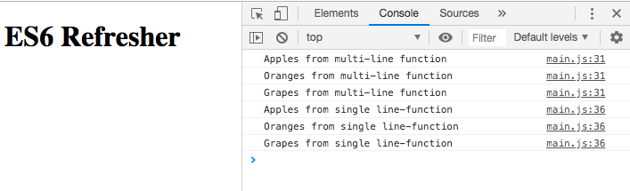

# React Front to Back

## Udemy React Tutorial Notes Section 2: Getting Started - Part 1

1. [ Intro ](#intro)
2. [ ES6 Refresher ](#es6-refresher)
3. [ High Order Array Methods ](#high-order-array-methods)
4. [ Destructuring ](#destructuring)
5. [ Classes ](#classes)
6. [ Sub Classes ](#sub-classes)
7. [ Modules ](#modules)

<a data="intro"></a>
### **_Intro_**

- Client side JavaScript library
- Renders everything as a "component"
- the "V" in MVC
- Rendering is known as a "Virtual DOM"
- AJAX on steriods
- React is often called a Framework
- What React doesn't have which most frameworks do is:
  - React doesn't have Routing at its core.
  - React doesn't have its own HTTP client

<a data="es6-refresher"></a>
### **_ES6 Refresher_**

#### **`const`** **and** **`let`**

- `const` and `let` are new in ES6 and they were created for block level scoping.
- `const` is different than `let` in that you cannot reassign a `const` variable.
- Another difference between `const` and `let` is that you cannot initialize a `const` without a value. You need to use `let` if you need to initialize a variable without a value.
- When creating an object with `const`, you can still modify the properties in that object, however you cannot re-initialize (re-create) that same object. This is the same with `const` arrays.
- It is recommended to use `const` whenever possible and only use `let` when you know that you will re-assign that variable or need to initialize something and add value to it later.

#### **Arrow Functions**

The old way of writing a function:

```javascript
function sayHello() {
  console.log("hello");
}
sayHello();
```

The ES6 way:

```javascript
const sayHelloFromES6 = () => {
  console.log("hello from ES6 function");
};
sayHelloFromES6();
```

If there are no variables being declared and you are just returning one value, it's much cleaner to have the whole function in one line.

```javascript
const sayHelloFromES6two = () => console.log("hello from ES6-2 function");
```

You can add parameters in arrow functions as well. If you only have one parameter, the parenthese are not needed.

```javascript
const sayHelloFromES6three = name => console.log("hello from " + name);
sayHelloFromES6three("Liz");
```

Another great thing about ES6 are _template literals_, which makes using the concatinating operator unnecessary.

```javascript
const sayHelloFromES6four = name => console.log(`hello from ${name}`);
sayHelloFromES6four("Liz");
```

<a data="high-order-array-methods"></a>
### **_High Order Array Methods_**

The `forEach` array method is used to loop through an array (among other things).

```javascript
const fruits = ['Apples', 'Oranges', 'Grapes'];

fruits.forEach((fruit, index) =>{
  console.log(fruit + " from multi-line function");
})

// and since this is only one line, you can reduce the above to: 

fruits.forEach((fruit, index) => console.log(fruit + " from single line-function"));
```

The code above returns the following in the console:





`.map` is similar to `.forEach` however it returns an array and you can change each item in the array. In the below example, we're going to remove the 's' on every fruit in the fruits array and store them in a new array.

```javascript
const singleFruit = fruits.map(fruit => fruit.slice(0, -1));
console.log(singleFruit);
```

You can manipulate it in anyway that you want. For example, if you want to make all the characters uppercase, you can tag on the `.toUpperCase` method.

```javascript
const singleFruit = fruits.map(fruit => fruit.slice(0, -1).toUpperCase());
console.log(singleFruit);
```

`.filter` is used to return an array with things filtered out. `.filter` is often used in state managers like Redux or context APIs where you want to delete something from the state, you want to "filter" it out.

The reason filer is used a lot in React is because in React your state is immutable, you can't directly change it.

```javascript
const people = [
  { id: 1, name: "Karen" },
  { id: 2, name: "Bob" },
  { id: 3, name: "Sharon" }
];

// now let's return an new array with Bob removed.

const people2 = people.filter(person => person.id !== 2);
console.log(people2);
```

`.spread` allows us to spread values out whether they are array elements or object properties. The spread operator is `...` followed by the variable that is being spread. You can then add a comma and values after the comma to add values to the end of the array. (Using the spread operator basically makes a copy with the added values you've added.)

```javascript
const arr = [1, 2, 3];
const arr2 = [...arr, 4];

console.log(arr2);
// console returns (4) [1, 2, 3, 4]
```

You can use the spread operator with objects as well. You can make a new object based on another object.

```javascript
const person = {
  name: "Brad",
  age: 36
};

const newPerson = {
  ...person,
  email: "brad@gmail.com"
};
```

This is super useful in React because the state is immutable, you have to make a copy of it and the spread operator allows you to take everything that already exists in the state and then add to it.

A cool thing about the spread operator is that we can use in combination with things like `.filter`.

```javascript
const arr3 = [...arr.filter(num => num !== 2)];
console.log(arr3);
```

<a data="destructuring"></a>
### **_Destructuring_**

Destructuring is used to pull values out of objects and arrays and assign those values to new variables.

```javascript
const profile = {
  name: "John Doe",
  address: {
    street: "40 Main street",
    city: "Boston"
  },
  hobbies: ["movies", "music"]
};

const { name, address, hobbies } = profile;
console.log(name, address, hobbies[0]);
```

Dot notation can be used to access nested values as well.

```javascript
const { street } = profile.address;
console.log(street);
```

<a data="classes"></a>

### **_Classes_**

It's very important to understand classes because in React you have class based components and functional based components. Class based components are a lot more common because that's where you can have state.

```javascript
class Person {
  constructor() {
    this.name = "John";
  }
}

const person1 = new Person();
const person2 = new Person();

console.log(person1.name);
```

The example above will have have both person1 and person2 name return the same static string 'John'. In order to have a dynamic class, we want to pass properties to that class. The example below shows how to create properties with a constructor function.

```javascript
class Person {
  constructor(name) {
    this.name = name;
  }
}

const person1 = new Person("John");
const person2 = new Person("Sarah");

console.log(person1.name);
console.log(person2.name);
```

Now that our class has dynamic properties, let's create a method in our class.

```javascript
class Person {
  constructor(name, age) {
    this.name = name;
    this.age = age;
  }

  greet() {
    return `hello, my name is ${this.name} and I am ${this.age}`;
  }
}

const person1 = new Person("John", 33);
const person2 = new Person("Sarah", 28);
```

<a data="sub-classes"></a>

### **_Sub Classes_**

Sub classes extend other classes. This happens a lot in React because in React you need to extend the core React component class. Sub classes inherit the properties of the class it is extending. In order to do this, you need to use a function called super.

The super function will need properties that are part of the parent constructor.

```javascript
class Person {
  constructor(name, age) {
    this.name = name;
    this.age = age;
  }
  greet() {
    return `hello, my name is ${this.name} and I am ${this.age}`;
  }
}

class Customer extends Person {
  constructor(name, age, balance) {
    super(name, age);
    this.balance = balance;
  }

  info() {
    return `${this.name} owes $${this.balance}.00`;
  }
}

const customer1 = new Customer("Kevin", 32, 300);
console.log(customer1.info());
```

<a data="modules"></a>

### **_Modules_**

Modules allow us to use variables, functions, classes and objects from other files. In order to do this, you need to export whatever you need to import into other files.

```javascript
// file1.js

export const name = "Jeff";
export const nums = [1, 2, 3];

// file2.js

import { name, nums } from "file1";
```

We also have something called export default with allows us to set values incase there is no value set from where we are importing that exported function, class, object or variable. When you export something default, you don't need curly braces when you import it.

```javascript
// file1.js
export default Person;
// file2.js
import Person from "file1";
```
