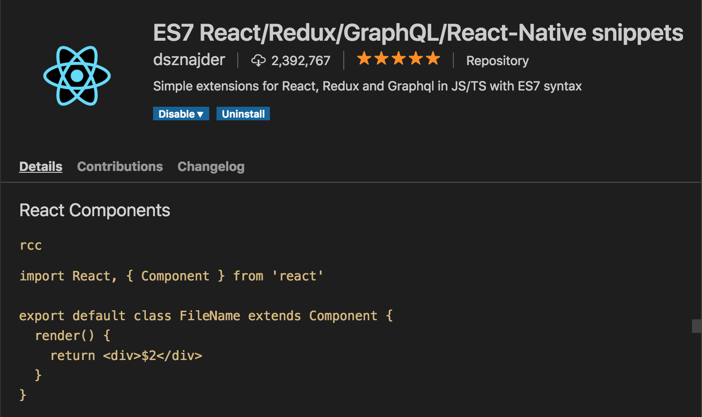
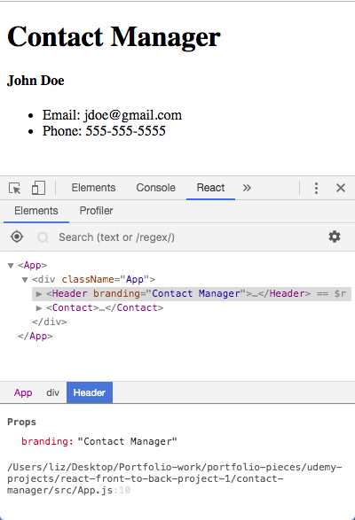

# React Front to Back

## Udemy React Tutorial Notes Section 3: Components, JSX and Props - Part 2

1. [ Custom Class Component ](#class-component)
2. [ Custom Functional Component ](#functional-component)
3. [ Functional Component Properties ](#functional-props)
4. [ Class Component Properties ](#class-props)


<a data="class-component"></a>
### **_Custom Class Component_**

Start with creating a new folder inside your ```src``` folder called ```components```. You should have your components inside this folder. Name your components with a capital letter because they are classes and this follows common convention. For this tutorial, the first custom component we are building is called ```Contacts.js```.

A great way to create a custom component is to utlize the extention *VS Code ES7 React/Redux/React-Native/JS snippets*. Look at the documentation to see all the great shortcuts you can utilize. 

Documentation of *VS Code ES7 React/Redux/React-Native/JS snippets* extension: 


All you have to do is enter ```rcc``` and press tab, and to have a boiler plate class component created. 

Brad (the instructor) recommends moving the ```export default``` to the bottom with the extension prints ahead of the class definition.

```jsx
import React, { Component } from 'react'

class Contact extends Component {
  render() {
    return (
      <div>
        <h4>John Doe</h4>
        <ul>
           <li>Email: jdoe@gmail.com</li>
           <li>Phone: 555-555-5555 </li>
        </ul>
      </div>
    );
  }
}

export default Contact;
```

In order to display this in our application, we need to bring it into the main component. This is done by importing it to ```App.js``` (which is liek the meeting place of all our components).

```jsx
import React, { Component } from 'react';
import Contact from './components/Contact';
import './App.css';

class App extends Component {
  render() {
    return (
      <div className="App">
        <h1>The App Component</h1>
      </div>
    );
  }
}

export default App;
```

Once you've imported your component, you can use it in ```.render()``` in ```App.js``` by adding what looks like a custom html element.

```jsx
import React, { Component } from 'react';
import Contact from './components/Contact';
import './App.css';

class App extends Component {
  render() {
    return (
      <div className="App">
        <h1>The App Component</h1>
        <Contact />
      </div>
    );
  }
}

export default App;
```


<a data="functional-component"></a>
### **_Custom Functional Component_**

Functional Components can be used as well as long as we don't plan on using any state within them. Functional Components are best for things like a static header, or like in th twitter example, the "sign-up now" component that is the same for all users.

```jsx
import React from 'react'

const Header = () => {
  return (
    <div>
      <h1>Contact Manager</h1>
    </div>
  )
}

export default Header;
```

Just like with Class Components, you will need to import your functional components.

```jsx
import React, { Component } from 'react';
import Contact from './components/Contact';
import Header from './components/Header';
import './App.css';

class App extends Component {
  render() {
    return (
      <div className="App">
        <Header />
        <Contact />
      </div>
    );
  }
}

export default App;
```

<a data="functional-props"></a>
### **_Functional Component Properties_**

Properties are passed to components like attributes (just like HTML attributes). You can name the properties however you want.

```jsx
import React, { Component } from 'react';
import Contact from './components/Contact';
import Header from './components/Header';
import './App.css';

class App extends Component {
  render() {
    return (
      <div className="App">
        <Header branding="Contact Manager"/>
        <Contact />
      </div>
    );
  }
}

export default App;
```

You can access the property in a functional component by creating a parameter in your functional component as follows:

```jsx
import React from 'react'

const Header = (props) => {
  return (
    <div>
      <h1>{props.branding}</h1>
    </div>
  )
}

export default Header;
```

You can always check a components props in the console:



To make our code more neat, use destructring:

```jsx
import React from "react";

const Header = props => {
  const { branding } = props;
  return (
    <div>
      <h1>{branding}</h1>
    </div>
  );
};

export default Header;
```

<a data="class-props"></a>
### **_Class Component Properties_**


Just like with Functional Components, start by giving your Class Component attributes for each property that you need.

```jsx
import React, { Component } from 'react';
import Contact from './components/Contact';
import Header from './components/Header';
import './App.css';

class App extends Component {
  render() {
    return (
      <div className="App">
        <Header branding="Contact Manager"/>
        <Contact name="John Doe" email="jdoe@gmail.com" phone="555-555-5555"/>
      </div>
    );
  }
}

export default App;
```

Unlike Functional components, we access ```props``` by using ```this.props.propName``` as you can see below:

```jsx
import React, { Component } from 'react'

class Contact extends Component {
  render() {
    return (
      <div>
        <h4>{this.props.name}</h4>
        <ul>
           <li>Email: {this.props.email}</li>
           <li>Phone: {this.props.phone}</li>
        </ul>
      </div>
    );
  }
}

export default Contact;
```

To make our code more neat, use destructring:

```jsx
import React, { Component } from 'react'

class Contact extends Component {
  render() {
    const { name, email, phone } = this.props;
    return (
      <div>
        <h4>{name}</h4>
        <ul>
           <li>Email: {email}</li>
           <li>Phone: {phone}</li>
        </ul>
      </div>
    );
  }
}

export default Contact;
```


