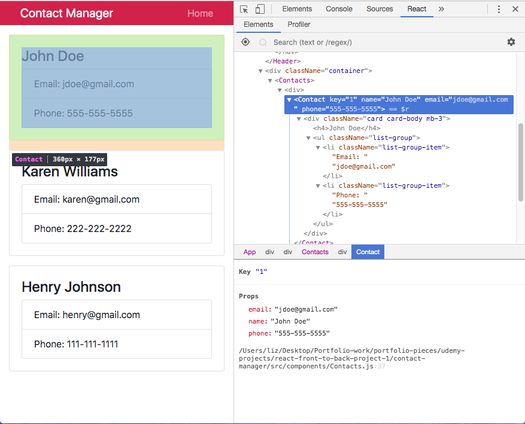
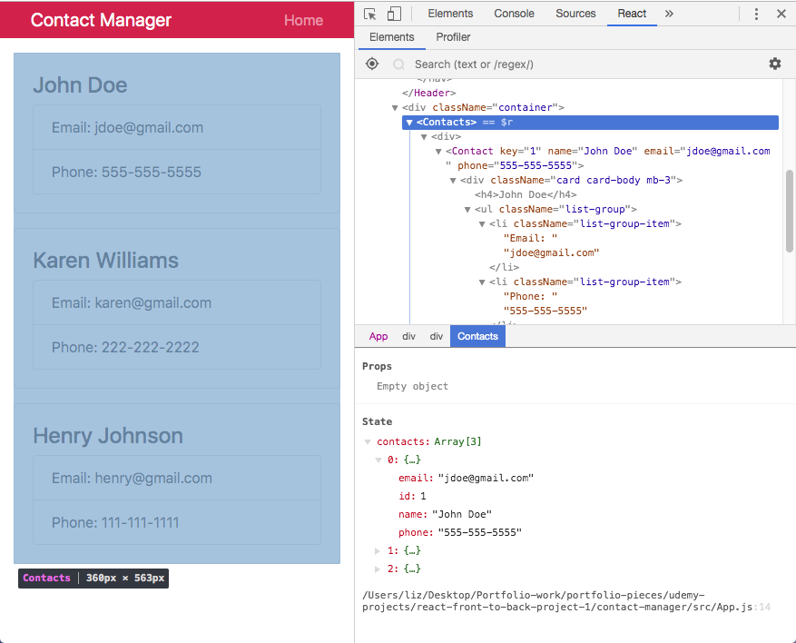

# React Front to Back

## Udemy React Tutorial Notes Section 4: State and Context API - Part 1

1. [ Intro ](#intro)
2. [ Passing State to Props with a Constructor ](#state-to-props-constructor)
3. [ Inspecting State and Props ](#inspecting)
4. [ Passing State to Props without a Constructor ](#state-to-props-without-constructor)
5. [ Pass Object Instead of Individual Props ](#pass-object)
6. [ Adjusting PropTypes for Object ](#object-prop-type)


<a data="intro"></a>
### **_Intro_**

In this tutorial, state will be demonstrated by creating a ```Contacts.js``` (plural) component which will have state. The ```Contacts.js``` component will be an object which will hold all the different contacts. We will then loop through the ```Contacts.js``` component for each contact in the state of ```Contacts.js``` and output a contact component for each singular contact.

<a data="state-to-props-constructor"></a>
### **_Passing State to Props with a Constructor_**

Start by creating a ```Contacts.js``` file inside your components folder. This component will definitely have to be a class based component because it is going to have state. Start by creating a ```constructor``` function.

```jsx
import React, { Component } from 'react'
 
class Contacts extends Component {

  constructor(){
    super();
    this.state = {
      contacts: [
        {
          id: 1,
          name: 'John Doe',
          email: 'jdoe@gmail.com',
          phone: '555-555-5555'
        },
        {
          id: 2,
          name: 'Karen Williams',
          email: 'karen@gmail.com',
          phone: '222-222-2222'
        },
        {
          id: 3,
          name: 'Henry Johnson',
          email: 'henry@gmail.com',
          phone: '111-111-1111'
        }
      ]
    }
  }

  render() {
    return (
      <div>
        
      </div>
    )
  }
}

export default Contacts;
```

The state in the example above is an array of objects. Remember that you need the ```super();``` function because you are extending another component.

Once you've defined the state, you want to loop through the state and output a ```contact``` component for each ```contact``` in the ```contacts``` state and insert the properties of each ```contact```.

The first thing to do is destructure the state ```contacts```.

```jsx
import React, { Component } from 'react'
 
class Contacts extends Component {

  constructor(){
    super();
    this.state = {
      contacts: [
        {
          id: 1,
          name: 'John Doe',
          email: 'jdoe@gmail.com',
          phone: '555-555-5555'
        },
        {
          id: 2,
          name: 'Karen Williams',
          email: 'karen@gmail.com',
          phone: '222-222-2222'
        },
        {
          id: 3,
          name: 'Henry Johnson',
          email: 'henry@gmail.com',
          phone: '111-111-1111'
        }
      ]
    }
  }

  render() {
    const { contacts } = this.state;
    return (
      <div>
        
      </div>
    )
  }
}

export default Contacts;
```

Next you want to loop through the ```const { contacts } = this.state;``` variable and this is done with ```.map()```.

```jsx
import React, { Component } from 'react'
 
class Contacts extends Component {

  constructor(){
    super();
    this.state = {
      contacts: [
        {
          id: 1,
          name: 'John Doe',
          email: 'jdoe@gmail.com',
          phone: '555-555-5555'
        },
        {
          id: 2,
          name: 'Karen Williams',
          email: 'karen@gmail.com',
          phone: '222-222-2222'
        },
        {
          id: 3,
          name: 'Henry Johnson',
          email: 'henry@gmail.com',
          phone: '111-111-1111'
        }
      ]
    }
  }

  render() {
    const { contacts } = this.state;
    return (
      <div>
        {contacts.map(contact => (
          <h1>{contact.name}</h1>
        ))}
      </div>
    )
  }
}

export default Contacts;
```

The loop created above won't work until we've included it to ```App.js```. Since we will be importing ```Contact.js``` into ```Contacts.ja```, we can simply change ```Contact.js``` to ```Contacts.js```. Once you've imported ```Contacts.js```, you'll have to change your ```<Contact />``` component to a single ```<Contact />``` component. 

```jsx
import React, { Component } from 'react';
import Contacts from './components/Contacts';
import Header from './components/Header';

import 'bootstrap/dist/css/bootstrap.min.css'
import './App.css';

class App extends Component {
  render() {
    return (
      <div className="App">
        <Header branding="Contact Manager"/>
        <div className="container">
          {<Contacts />}
        </div>
      </div>
    );
  }
}

export default App;
```

In order to change the ```Contacts.js``` component to output a ```Contact.js``` component per contact (not just the name), we need to first import the ```Contact.js``` component into the ```Contacts.js``` component.

Replace the ```<h1>``` in the loop in ```Contacts.js``` with the ```<Contact />``` component. Do remember that the ```<Contact />``` component takes in some properties. Furthermore, you must include a key because a warning will appear if there is no key for each item outputted in a loop. 

```jsx
import React, { Component } from 'react';
import Contact from './Contact';
 
class Contacts extends Component {

  constructor(){
    super();
    this.state = {
      contacts: [
        {
          id: 1,
          name: 'John Doe',
          email: 'jdoe@gmail.com',
          phone: '555-555-5555'
        },
        {
          id: 2,
          name: 'Karen Williams',
          email: 'karen@gmail.com',
          phone: '222-222-2222'
        },
        {
          id: 3,
          name: 'Henry Johnson',
          email: 'henry@gmail.com',
          phone: '111-111-1111'
        }
      ]
    }
  }

  render() {
    const { contacts } = this.state;
    return (
      <div>
        {contacts.map(contact => (
          <Contact 
            key={contact.id}
            name={contact.name} 
            email={contact.email}
            phone={contact.phone} />
        ))}
      </div>
    )
  }
}

export default Contacts;
```


<a data="inspecting"></a>
### **_Inspecting State and Props_**

Viewing a component's properties:



Viewing a component's state:




<a data="state-to-props-without-constructor"></a>
### **_Passing State to Props without a Constructor_**

It is possible to define state without a constructor as seen in the following:

```jsx
import React, { Component } from 'react';
import Contact from './Contact';
 
class Contacts extends Component {

  state = {
    contacts: [
      {
        id: 1,
        name: 'John Doe',
        email: 'jdoe@gmail.com',
        phone: '555-555-5555'
      },
      {
        id: 2,
        name: 'Karen Williams',
        email: 'karen@gmail.com',
        phone: '222-222-2222'
      },
      {
        id: 3,
        name: 'Henry Johnson',
        email: 'henry@gmail.com',
        phone: '111-111-1111'
      }
    ]
  }
  
  render() {
    const { contacts } = this.state;
    return (
      <div>
        {contacts.map(contact => (
          <Contact 
            key={contact.id}
            name={contact.name} 
            email={contact.email}
            phone={contact.phone} />
        ))}
      </div>
    )
  }
}

export default Contacts;
```

<a data="pass-object"></a>
### **_Pass Object Instead of Individual Props_**

Instead of passing individual properties, you can pass an object. If you decide to do this, you will need to adjust both ```Contacts.js``` and ```Contact.js```.

#### ```Contacts.js```

```jsx
import React, { Component } from 'react';
import Contact from './Contact';
 
class Contacts extends Component {

  state = {
    contacts: [
      {
        id: 1,
        name: 'John Doe',
        email: 'jdoe@gmail.com',
        phone: '555-555-5555'
      },
      {
        id: 2,
        name: 'Karen Williams',
        email: 'karen@gmail.com',
        phone: '222-222-2222'
      },
      {
        id: 3,
        name: 'Henry Johnson',
        email: 'henry@gmail.com',
        phone: '111-111-1111'
      }
    ]
  }
  
  render() {
    const { contacts } = this.state;
    return (
      <div>
        {contacts.map(contact => (
          <Contact 
            key={contact.id}
            contact={contact}  
          />
        ))}
      </div>
    )
  }
}

export default Contacts;
```

#### ```Contact.js```

```jsx
import React, { Component } from 'react';
import propTypes from 'prop-types'

class Contact extends Component {

   static propTypes = {
    name: propTypes.string.isRequired,
    email: propTypes.string.isRequired,
    phone: propTypes.string.isRequired
  }

  render() {
    const { contact } = this.props;
    return (
      <div className="card card-body mb-3">
        <h4>{contact.name}</h4>
        <ul className="list-group">
           <li className="list-group-item">Email: {contact.email}</li>
           <li className="list-group-item">Phone: {contact.phone}</li>
        </ul>
      </div>
    );
  }
}

// Contact.propTypes = {
//   name: propTypes.string.isRequired,
//   email: propTypes.string.isRequired,
//   phone: propTypes.string.isRequired
// }

export default Contact;
```

To have even neater code, use destructing in ```Contact.js```:

```jsx
import React, { Component } from 'react';
import propTypes from 'prop-types'

class Contact extends Component {

   static propTypes = {
    name: propTypes.string.isRequired,
    email: propTypes.string.isRequired,
    phone: propTypes.string.isRequired
  }

  render() {
    const { name, email, phone } = this.props.contact;
    return (
      <div className="card card-body mb-3">
        <h4>{name}</h4>
        <ul className="list-group">
           <li className="list-group-item">Email: {email}</li>
           <li className="list-group-item">Phone: {phone}</li>
        </ul>
      </div>
    );
  }
}

export default Contact;
```

<a data="object-prop-type"></a>
### **_Adjusting PropTypes for Object_**

Do check the console for errors. When doing so at this point in the tutorial, the console shows errors of ```propType```. This is because we are so longer passing a string, we are passing an object with properties. 

```jsx
import React, { Component } from 'react';
import propTypes from 'prop-types'

class Contact extends Component {

   static propTypes = {
    contact: propTypes.object.isRequired
  }

  render() {
    const { name, email, phone } = this.props.contact;
    return (
      <div className="card card-body mb-3">
        <h4>{name}</h4>
        <ul className="list-group">
           <li className="list-group-item">Email: {email}</li>
           <li className="list-group-item">Phone: {phone}</li>
        </ul>
      </div>
    );
  }
}

// Contact.propTypes = {
//  contact: propTypes.object.isRequired
// }

export default Contact;
```