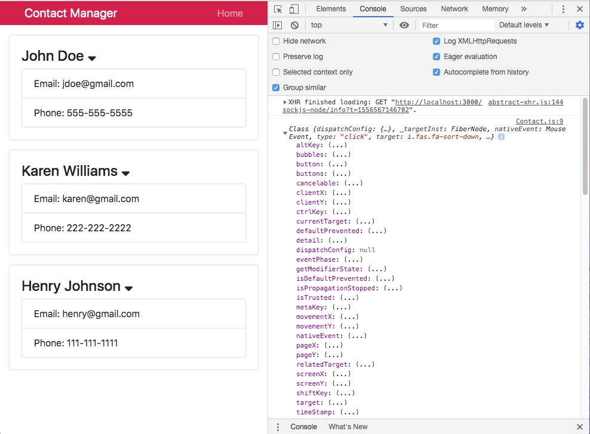

# React Front to Back

## Udemy React Tutorial Notes Section 4: State and Context API - Part 2

1. [ Events In React ](#events)
2. [ Binding Custom Methods ](#binding)
3. [ Define this without Binding ](#this-no-bind) 
4. [ Using Bind to Pass in a Parameter ](#bind-for-parameter) 

<a data="events"></a>
### **_Events In React_**

We will add the font awesome library so we can build a toggle effect when clicing an icon. You can add the CDN into ```index.html``` in the ```public``` folder, or use ```npm``` to install a package. In this tutorial, we use the CDN.

To start, add an ```onClick``` to the element of your choosing. It is similar to inline Javascript, however it is camelCased. To test your event, start with an inline ```function```.

```jsx
import React, { Component } from "react";
import propTypes from "prop-types";

class Contact extends Component {
  render() {
    const { name, email, phone } = this.props.contact;
    return (
      <div className="card card-body mb-3">
        <h4>
          {name}{" "}
          <i
            onClick={() => console.log("Hello")}
            className="fas fa-sort-down"
          />
        </h4>
        <ul className="list-group">
          <li className="list-group-item">Email: {email}</li>
          <li className="list-group-item">Phone: {phone}</li>
        </ul>
      </div>
    );
  }
}

Contact.propTypes = {
  contact: propTypes.object.isRequired
};

export default Contact;
```

Once your ```onClick``` is logging to the console, create a whole new function. We will create a method in this same ```Contact``` class, which will require that you use ```.this``` as seen below:

```jsx
import React, { Component } from "react";
import propTypes from "prop-types";

class Contact extends Component {
  onShowClick() {
    console.log("Hello World");
  }

  render() {
    const { name, email, phone } = this.props.contact;
    return (
      <div className="card card-body mb-3">
        <h4>
          {name} <i onClick={this.onShowClick} className="fas fa-sort-down" />
        </h4>
        <ul className="list-group">
          <li className="list-group-item">Email: {email}</li>
          <li className="list-group-item">Phone: {phone}</li>
        </ul>
      </div>
    );
  }
}

Contact.propTypes = {
  contact: propTypes.object.isRequired
};

export default Contact;
```

We are one step close to creating the toggle effect we are looking for once we have our ```onClick``` event triggering a method. Next we will need to alter some state and utilize a boolean in order to create the toggle effect. However before we can start altering state, we will need to ```bind``` our method because it is a custom method, it is not a core method such as ```componentDidMount()``` and other such lifecyle methods that are core to React.

<a data="binding"></a>
### **_Binding Custom Methods_**

State cannot be altered unless you bind your custom method first. The follow won't work:

```jsx
import React, { Component } from "react";
import propTypes from "prop-types";

class Contact extends Component {
  state = {}

  onShowClick() {
    console.log(this.state);
  }

  render() {
    const { name, email, phone } = this.props.contact;
    return (
      <div className="card card-body mb-3">
        <h4>
          {name} <i onClick={this.onShowClick} className="fas fa-sort-down" />
        </h4>
        <ul className="list-group">
          <li className="list-group-item">Email: {email}</li>
          <li className="list-group-item">Phone: {phone}</li>
        </ul>
      </div>
    );
  }
}

Contact.propTypes = {
  contact: propTypes.object.isRequired
};

export default Contact;
```

We get an error that says: "```cannot read propoerty state of undefined.```". This is because the component currently does now know what ```this``` is (```this``` hasn't been defined yet) and your custom method isn't a core method. To bind your custom method, add ```.bind``` to your event where you are calling your custom method and pass ```this``` as a parameter.

```jsx
import React, { Component } from "react";
import propTypes from "prop-types";

class Contact extends Component {
  state = {}

  onShowClick() {
    console.log(this.state);
  }

  render() {
    const { name, email, phone } = this.props.contact;
    return (
      <div className="card card-body mb-3">
        <h4>
          {name} <i onClick={this.onShowClick.bind(this)} className="fas fa-sort-down" />
        </h4>
        <ul className="list-group">
          <li className="list-group-item">Email: {email}</li>
          <li className="list-group-item">Phone: {phone}</li>
        </ul>
      </div>
    );
  }
}

Contact.propTypes = {
  contact: propTypes.object.isRequired
};

export default Contact;
```

Another method to bind ```this``` in your custom method is to utilize a constructor as follows:

```jsx
import React, { Component } from "react";
import propTypes from "prop-types";

class Contact extends Component {
  constructor() {
    super();
    this.state = {};
    this.onShowClick = this.onShowClick.bind(this);
  }

  onShowClick() {
    console.log(this.state);
  }

  render() {
    const { name, email, phone } = this.props.contact;
    return (
      <div className="card card-body mb-3">
        <h4>
          {name} <i onClick={this.onShowClick} className="fas fa-sort-down" />
        </h4>
        <ul className="list-group">
          <li className="list-group-item">Email: {email}</li>
          <li className="list-group-item">Phone: {phone}</li>
        </ul>
      </div>
    );
  }
}

Contact.propTypes = {
  contact: propTypes.object.isRequired
};

export default Contact;
```

<a data="this-no-bind"></a>
### **_Define this without Binding_**

You can avoid having to use ```.bind()``` by using an arrow function. 

```jsx
import React, { Component } from "react";
import propTypes from "prop-types";

class Contact extends Component {

  state = {};

  onShowClick = () => {
    console.log(this.state);
  }

  render() {
    const { name, email, phone } = this.props.contact;
    return (
      <div className="card card-body mb-3">
        <h4>
          {name} <i onClick={this.onShowClick} className="fas fa-sort-down" />
        </h4>
        <ul className="list-group">
          <li className="list-group-item">Email: {email}</li>
          <li className="list-group-item">Phone: {phone}</li>
        </ul>
      </div>
    );
  }
}

Contact.propTypes = {
  contact: propTypes.object.isRequired
};

export default Contact;
```

Passing ```e``` (for event) as a parameter in your arrow function will provide you will lots of useful information as well.

```jsx
import React, { Component } from "react";
import propTypes from "prop-types";

class Contact extends Component {

  state = {};

  onShowClick = (e) => {
    console.log(e);
  }

  render() {
    const { name, email, phone } = this.props.contact;
    return (
      <div className="card card-body mb-3">
        <h4>
          {name} <i onClick={this.onShowClick} className="fas fa-sort-down" />
        </h4>
        <ul className="list-group">
          <li className="list-group-item">Email: {email}</li>
          <li className="list-group-item">Phone: {phone}</li>
        </ul>
      </div>
    );
  }
}

Contact.propTypes = {
  contact: propTypes.object.isRequired
};

export default Contact;
```

Info from the console:




You can access all sorts of properties from the event with dot notation.

```jsx
console.log(e.target);
//this will show the element that is being targetted
```

<a data="bind-for-parameter"></a>
### **_Using Bind to Pass in a Parameter_**

If you want your event to pass something in (usually an ID), you would use ```.bind()```. The example below works so that when you click the ```<i>```, the console logs the name of that contact.

```jsx
import React, { Component } from "react";
import propTypes from "prop-types";

class Contact extends Component {

  state = {};

  onShowClick = (name, e) => {
    console.log(name);
  }

  render() {
    const { name, email, phone } = this.props.contact;
    return (
      <div className="card card-body mb-3">
        <h4>
          {name} <i onClick={this.onShowClick.bind(this, name)} className="fas fa-sort-down" />
        </h4>
        <ul className="list-group">
          <li className="list-group-item">Email: {email}</li>
          <li className="list-group-item">Phone: {phone}</li>
        </ul>
      </div>
    );
  }
}

Contact.propTypes = {
  contact: propTypes.object.isRequired
};

export default Contact;
```

