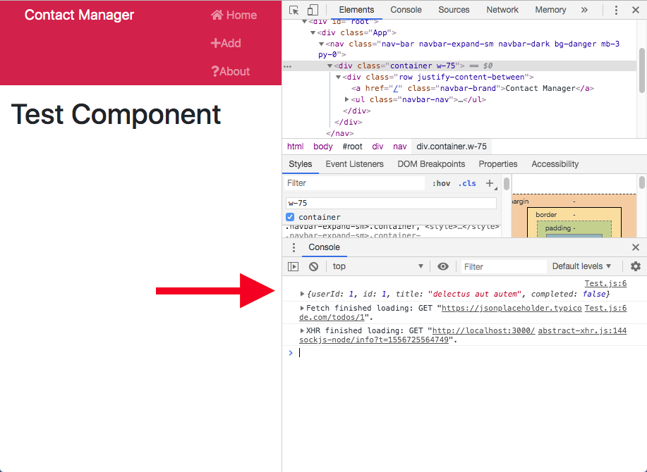
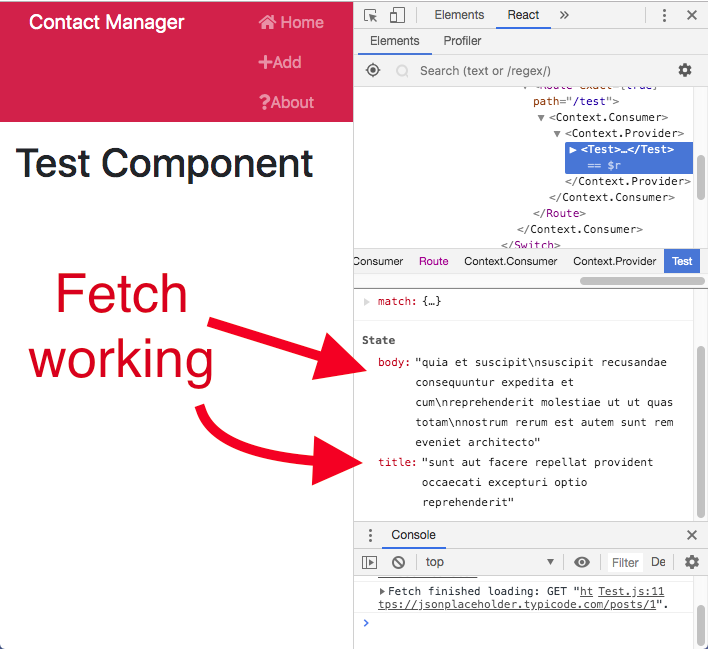

# React Front to Back

## Udemy React Tutorial Notes Section 7: Lifeclyes, HTTP and Deployment - Part 1

1. [ Lifecyle Methods ](#lifecycle-methods)
2. [ GET Requests ](#get-requests)
3. [ Display Data from GET Request ](#display-data-from-GET-request)
4. [ Axios ](#axios)

<a data="lifecycle-methods"></a>

### **_Lifecyle Methods_**

Inside the core component class, which every component extends, there are methods. So far we've only dealt with `render()` which is necessary for any component to show up on your app.

General Info about core component methods:

- Lifecycle methods are only available in classes.
- You don't need to use arrow functions with core component methods because they are part of the component class which we are always extending.
- `componentWillReceiveProps`, `componentWillMount` and `componentWillUpdate` are being deprecated. You can still use them in React 17, however you will need to add a flag of `UNSAFE__` before the method as such:

```jsx
UNSAFE_componentWillMount();
```

#### Often used core component methods:

- `componentDidMount()`

  - This is the second most used core method (according to Brad).
  - Whatever you put in that function is going to fireoff after the component mounts.
  - `componentDidMount()` is where you usually make HTTP calls (AJAX and stuff usually goes into this method)

- `componentWillMount()`

  - This method runs before the component will mount.
  - This method will run before `componentDidMount()`

- `componentDidUpdate()`

  - This method will only run when the component updates.
  - Changing its state qualifies as an update.
  - Basically when the component re-renders, this method will be called.

- `componentWillUpdate()`

  - This method will run at the same time as `componentDidUpdate()`

- `componentWillReceiveProps(nextProps, nextState)`

  - This method takes in 2 parameters, `nextProps` and `nextState`.
  - This method will run when your component recieves new propoerties.
  - This is often used in Redux

- `static getDerivedStateFromProps(nextProps, nextState)`

  - This method takes in 2 parameters, `nextProps` and `nextState` also and will replace `componentWillReceiveProps(nextProps, nextState)`.
  - This must be defined as static.
  - With this method, you have to return either some state that you want to change or null or else you'll get an error.
  - You cannot use `setState` with this method.

- `getSnapshotBeforeUpdate(prevProps, prevState)`
  - This fires before mutuations are made, like before the DOM is updated.

<a data="get-requests"></a>

### **_GET Requests_**

To learn how to do a get request, we will be using https://jsonplaceholder.typicode.com/ a fake online REST API for testing and prototyping.

1. Grab the fetch method from the website and put it into your `componentDidMount()` method inside your `Test.js` component.

```jsx
import React, { Component } from "react";

class Test extends Component {
  componentDidMount() {
    fetch("https://jsonplaceholder.typicode.com/posts/1")
      .then(response => response.json())
      .then(json => console.log(json));
  }

  render() {
    return (
      <div>
        <h1>Test Component</h1>
      </div>
    );
  }
}

export default Test;
```

This code will `console.log` the response from typicode.



2. Create an intial state that has an empty title and body:

```jsx
import React, { Component } from "react";

class Test extends Component {
  state = {
    title: "",
    body: ""
  };

  componentDidMount() {
    fetch("https://jsonplaceholder.typicode.com/posts/1")
      .then(response => response.json())
      .then(json => console.log(json));
  }

  render() {
    return (
      <div>
        <h1>Test Component</h1>
      </div>
    );
  }
}

export default Test;
```

3. Then let's fill it when we make our requests. To do that, change the code inside your `componentDidMount()` function.
    - You will need to alter the `fetch()` method.
    - Change the second `.then` method from `console.log(json)` to setting the state from empty strings to the result of the API.

```jsx
import React, { Component } from 'react'

class Test extends Component {

  state = {
    title: '',
    body: ''
  }

  componentDidMount(){
    fetch('https://jsonplaceholder.typicode.com/posts/1')
    .then(response => response.json())
    .then(json => this.setState({
      title: json.title,
      body: json.body
    }))
  }

  render() {
    return (
      <div>
        <h1>Test Component</h1>
      </div>
    )
  }
}

export default Test
```

Make sure to check that your state is updating correctly in the React Dev Tools.




<a data="display-data-from-GET-request"></a>

### **_Display Data from GET Request_**

To display the data from the GET request:
1. Destructure the response from the GET request and definte a `title` and `body` variable
2. Add the `title` and `body` into your jsx

```jsx
import React, { Component } from 'react'

class Test extends Component {

  state = {
    title: '',
    body: ''
  }

  componentDidMount(){
    fetch('https://jsonplaceholder.typicode.com/posts/1')
    .then(response => response.json())
    .then(json => this.setState({
      title: json.title,
      body: json.body
    }))
  }

  render() {
    const {title, body} = this.state;
    return (
      <div>
        <h1>{title}</h1>
        <p>{body}</p>
      </div>
    )
  }
}

export default Test
```

<a data="axios"></a>

### **_Axios_**

1. Use npm to download axios.
```
npm i axios
```
2. Import `Axios` at the top in `context.js` (because that's where we are going to be using it).

```jsx
import axios from "axios";
```
3. Inside ```componentDidMount()```, use `axios.get()`. It returns a promise, so you can transform that promise to your state.

```jsx
import React, { Component } from "react";
import axios from "axios";

const Context = React.createContext();

const reducer = (state, action) => {
  switch (action.type) {
    case "DELETE_CONTACT":
      return {
        ...state,
        contacts: state.contacts.filter(
          contact => contact.id !== action.payload
        )
      };
      case "ADD_CONTACT":
      return {
        ...state,
        contacts: [action.payload, ...state.contacts]
      };
    default:
      return state;
  }
};

export class Provider extends Component {
  state = {
    contacts: [],
    dispatch: action => this.setState(state => reducer(state, action))
  };

  componentDidMount(){
    axios.get('https://jsonplaceholder.typicode.com/users').then(res => this.setState({contacts: res.data}))
  }

  render() {
    return ( 
      <Context.Provider value={this.state}>
        {this.props.children}
      </Context.Provider>
    );
  }
}

export const Consumer = Context.Consumer;
```

