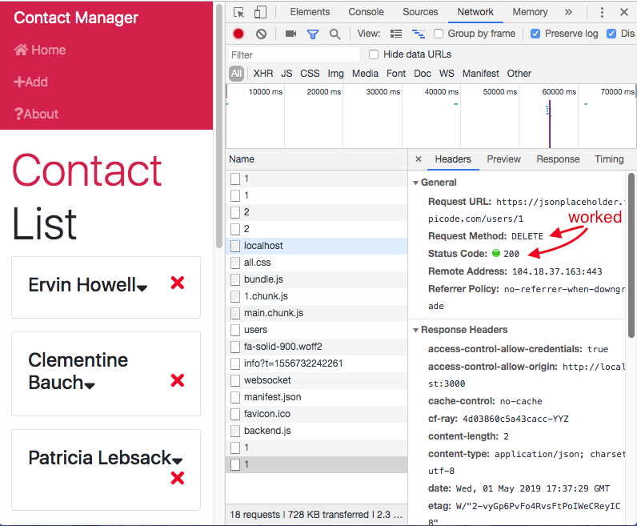

# React Front to Back

## Udemy React Tutorial Notes Section 7: Lifeclyes, HTTP and Deployment - Part 2

1. [ DELETE Requests ](#delete-requests)
2. [ POST Requests ](#post-requests)

<a data="delete-requests"></a>

### **_DELETE Requests_**

To mimmick a `DELETE` request with our fake REST API, we will need to go to where were are firing a function with each click of our delete icon, which is in `Contact.js`.

1. Import `axios` to `Contact.js`
2. We will need to make a `DETELE` request inside `onDeleteClick()`.
3. Grab the users url (https://jsonplaceholder.typicode.com/users) and add another slash to the end of the url so we can pass the contact `id` as a GET variable. You will need to use template literals in order to have a dynamic `id`. You will be able to pass the `id` because we have set-up the `id` as a paramter in `onDeleteClick`.
4. Since the HTTP request returns a promise, we can use `.then()` and then call our `dispatch`. What will end up happening is that `onDeleteClick` will first make the request to the back end, and then handle the dispatch.

```jsx
import React, { Component } from "react";
import propTypes from "prop-types";
import { Consumer } from "../../context";
import axios from "axios";

class Contact extends Component {
  state = {
    showContactInfo: false
  };

  onDeleteClick = (id, dispatch) => {
    axios
      .delete(`https://jsonplaceholder.typicode.com/users/${id}`)
      .then(res => dispatch({ type: "DELETE_CONTACT", payload: id }));
  };

  render() {
    const { id, name, email, phone } = this.props.contact;
    const { showContactInfo } = this.state;

    return (
      <Consumer>
        {value => {
          const { dispatch } = value;
          return (
            <div className="card card-body mb-3">
              <h4>
                {name}
                <i
                  onClick={() =>
                    this.setState({
                      showContactInfo: !this.state.showContactInfo
                    })
                  }
                  className="fas fa-sort-down"
                  style={{ cursor: "pointer" }}
                />
                <i
                  className="fas fa-times"
                  style={{ cursor: "pointer", float: "right", color: "red" }}
                  onClick={this.onDeleteClick.bind(this, id, dispatch)}
                />
              </h4>
              {showContactInfo ? (
                <ul className="list-group">
                  <li className="list-group-item">Email: {email}</li>
                  <li className="list-group-item">Phone: {phone}</li>
                </ul>
              ) : null}
            </div>
          );
        }}
      </Consumer>
    );
  }
}

Contact.propTypes = {
  contact: propTypes.object.isRequired
};

export default Contact;
```

5. Now to check that it's acutally making a request, open your console and go to the network tab. Click on the latest (the most bottom) file in the list and see the info under the Headers tab.



<a data="post-requests"></a>

### **_POST Requests_**

Go to your form that is submitting new data, which in our case is `AddContact.js`. Currently the code that we have is checking for errors and if none are found, running a dispatch of type `"ADD_CONTACT"`. What we need to change is that the dispatch run after a successful HTTP request. Basically we want to put `dispatch` inside `.then()` (the promise of the HTTp request). We also want to sent the HTTP response back in the payload. 

1. Start wth bringing axios into `AddContact.js`. 
2. Once you've brought in axios, remove `uuid` and the `uuid()` function.

```jsx
import React, { Component } from "react";
import { Consumer } from "../../context";
import TextInputGroup from "../layouts/TextInputGroup";
// import uuid from "uuid";
import axios from 'axios';

class AddContact extends Component {
  state = {
    name: "",
    email: "",
    phone: "",
    errors: {}
  };

  onChange = e => this.setState({ [e.target.name]: e.target.value });
  onSubmit = (dispatch, e) => {
    e.preventDefault();

    const { name, email, phone } = this.state;

    //Check For Errors

    if (name === "") {
      this.setState({ errors: { name: "Name is required" } });
      return;
    }

    if (email === "") {
      this.setState({ errors: { email: "Email is required" } });
      return;
    }

    if (phone === "") {
      this.setState({ errors: { phone: "Phone is required" } });
      return;
    }

    const newContact = {
      // id: uuid(),
      name,
      email,
      phone
    };

    dispatch({ type: "ADD_CONTACT", payload: newContact });

    //Clear inputs after submission
    this.setState({
      name: "",
      email: "",
      phone: "",
      errors: {}
    });

    this.props.history.push('/');

  };

  render() {
    const { name, email, phone, errors } = this.state;

    return (
      <Consumer>
        {value => {
          const { dispatch } = value;
          return (
            <div className="card mb-3">
              <div className="card-header">Add Contact</div>
              <div className="card-body">
                <form onSubmit={this.onSubmit.bind(this, dispatch)}>
                  <TextInputGroup
                    label="Name"
                    name="name"
                    placeholder="enter name..."
                    value={name}
                    onChange={this.onChange}
                    error={errors.name}
                  />
                  <TextInputGroup
                    label="Email"
                    name="email"
                    type="email"
                    placeholder="enter email..."
                    value={email}
                    onChange={this.onChange}
                    error={errors.email}
                  />
                  <TextInputGroup
                    label="Phone"
                    name="phone"
                    placeholder="enter phone..."
                    value={phone}
                    onChange={this.onChange}
                    error={errors.phone}
                  />
                  <input
                    type="submit"
                    value="Add Contact"
                    className="btn btn-block btn-light"
                  />
                </form>
              </div>
            </div>
          );
        }}
      </Consumer>
    );
  }
}

export default AddContact;

```

3. Now we can start using axios to do a `POST` request to the JSON placeholder API we're using. Before dispatch, add `axios.post('')`.
4. 