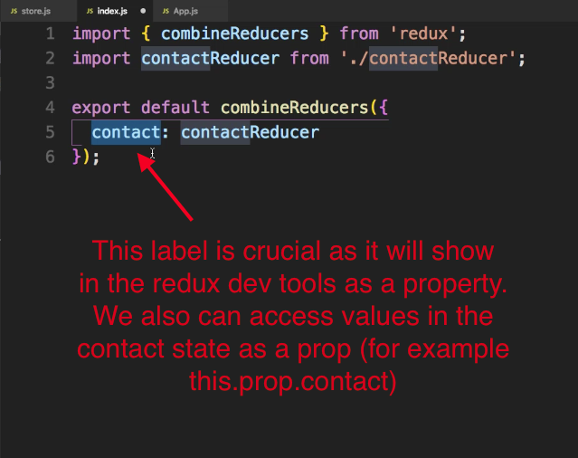
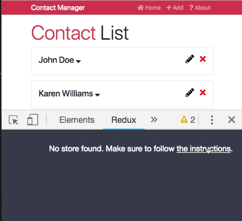
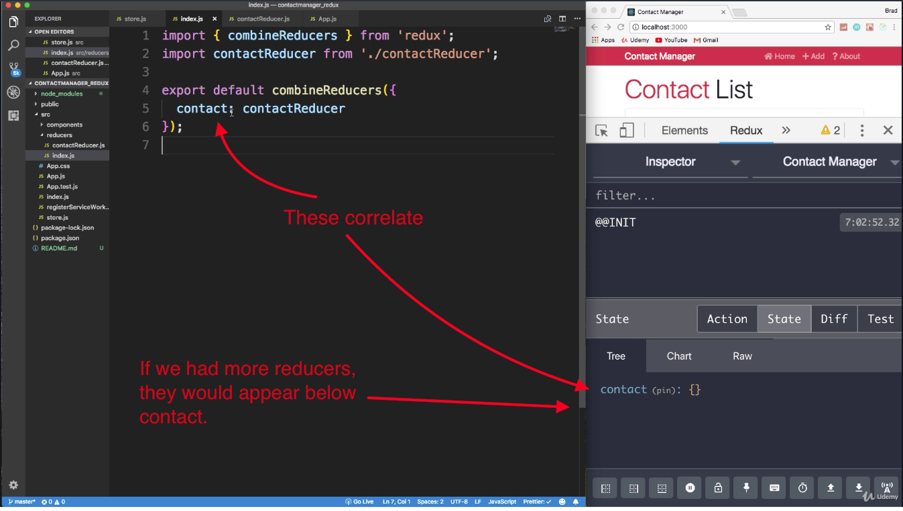

"# React Front to Back

## Udemy React Tutorial Notes Section 8: Learning Redux - Part 1

1. [ Redux Initial Setup ](#redux-intial-setup)
2. [ Redux Store ](#redux-store)
3. [ Adding Redux Store to App.js ](#adding-redux-store-to-app.js)
4. [ Viewing State in Redux Dev Tool ](#viewing-state-in-redux-dev-tool)


<a data="redux-intial-setup"></a>

### **Initial Redux Setup**

Redux can be used by itself and it can be used with other frameworks. Therefore, to use it with React, you will need to add the `Redux` module and the `Redux React` module, which is the library that connects the two together. We will also be using something called `React Thunk` which is a piece of middleware that works with dispatching. 

Use NPM to install the following dependencies:

```
npm i redux react-redux redux-thunk
```

<a data="redux-store"></a>

### **Redux Store**

With Redux, state is held in the store that also contains reducers that will receive actions. The reducers will also control what trickles down into our components from state. 

#### _Creating the Reducers_

1. In order to create our redux `store`, we first need to create our reducers.

    * Create a folder called `reducers` in your `src` folder.
    * Create a `contactReducer.js` file in your newly created `reducers` folder (see figure 1 - `reducers/contactReducer.js`).
      * Every reducer needs an initial state, so in `contactReducer.js`, create a variable called `initialSate` and have it be an empty object.
      * Then export a dumb component which will have a parameter for `state` and another for `action`. (And just like the context API, actions will be evaluated by their type, for example `'DELETE_CONTACT'`).
      * Inside the dumb component, have a `switch` statement for your actions.
      * Your `switch` statement should take a parameter of `action.type`. For now, we can `return` a `default` that simply returns the `state`.
    * Inside your `reducers` folder, create an `index.js` file. This file will act as a meeting place for all our reducers. For larger applications, there are usually many reducers, such as an author reducer for authentication, there'll be a profile reducer, and an error reducer (for example). 
      * Inside `reducers/index.js`, import `combineReducers` from `redux` (see figure 2 - `reducers/index.js`). 
      * You then need to export an instantiation of `combinedReducers`.
      * Inside your instantiation of `combinedReducers`, you need to label your reducers and set them (see figure 3). In our case, we are importing our `contactReducer` and labelling it `contact`.
    * Figure 4 shows the file structure of of your reducers folder.


##### Figure 1 - `reducers/contactReducer.js`

```jsx
const initialState = {};

export default function(state = initialState, action){
  switch(action.type){
    default:
      return state;
  }
}
```

##### Figure 2 - `reducers/index.js`

```jsx
import { combineReducers } from 'redux';
import contactReducer from './contactReducer';

export default combineReducers({
  contact: contactReducer
});
```

##### Figure 3



##### Figure 4

```
-src
  -components
  -reducers
    -contactReducers.js
    -index.js
```


#### _Creating the Store_


2. Create a `store.js` in your `src` folder (not inside your `reducers` folder!). (It is common for developers to create a store folder and then create an index file in there with different files for actions and other stuff.)
3. In `src/store.js`, we'll need to import some packages as well as your `reducers` folder:

    * Remember that you can use the `imp` plus `tab` to auto print import statements.
    * Import your `reducers` folder. This folder will act as the root reducer since your `reducers` folder has its own `index.js` file. (And since your `reducers` folder has its own `index.js` file, we don't need to type `./reducer/index.js` in the `rootReducer` import statement. Our `index.js` is the `rootReducer`).

```jsx
import { createStore, applyMiddleware, compose} from 'redux';
import thunk from 'redux-thunk';
import rootReducer from './reducer';
```

4. Next, in `store.js`, create an inital state and set it to an empty object.
    * The reason for doing this is because the `createStore` method takes an initial state as a parameter when it is run initially. 

```jsx
import { createStore, applyMiddleware, compose } from 'redux';
import thunk from 'redux-thunk';
import rootReducer from './reducer';

const initialState = {};
```

5. Next we need to create a variable called `middleware` for middleware. Since we are using `thunk` for middleware, create a variable that is an array that contains `thunk`.

```jsx
import { createStore, applyMiddleware, compose } from 'redux';
import thunk from 'redux-thunk';
import rootReducer from './reducer';

const initialState = {};

const middleware = [thunk];
```


6. Create another variable called `store` and set it to be the `createStore` method from `redux`. The `createStore` method will take in a number of parameters.
    * Parameter 1 of `createStore`: 
      * Pass in your `rootReducer`
    * Parameter 2 of `createStore`:
      * Pass in your `initialState`
    * Parameter 3 of `createStore`:
      *  This is where we want to add our middleware. We also need to use redux dev tools, so we will need to pass in a few things all into the third parameter (basically the third parameter has its own parameters). In order to be able to do this (pass multiple things into the third parameter), we need to use the `compose` method which we've destructured from  `redux` in the import statement.      
        * Parameter 1 of `compose()` - Pass in `applyMiddleware()` into `compose` (which we've also destructured from `redux`). `applyMiddleware` also takes a parameter.
          * Parameter of `applyMiddleware` - We will pass in the variable `middleware` (which is defined earlier and contains `thunk`) into `applyMiddleware()`.  You must add the spread operator before `middleware` to ensure that everything in our `middleware` variable is sucessfully passed in. Even though we only have `thunk` in our `middleware` variable, we could easily pass in more than `thunk`.
        * Parameter 2 of `compose()` - After you've passed `applyMiddleware` into `compose` as a first parameter, you need to pass in a second parameter to enable redux dev tools. Put a comma after the `applyMiddleware` method and add:

```
window.__REDUX_DEVTOOLS_EXTENSION__ && window.__REDUX_DEVTOOLS_EXTENSION__()
```

Being able to use Redux Dev Tools needs to be enabled. Without the line of code above, Redux Dev Tools will show the following:



The code to include as the second parameter of the `compose()` method comes from the official redux-dev-tools Github page which is accessible from _the instructions_ link provided in the _no store found_ message page from the inspector.

  * Lastly, you need to export the store.

The result of `store.js` is:

```jsx
import { createStore, applyMiddleware, compose} from 'redux';
import thunk from 'redux-thunk';
import rootReducer from './reducer';

const initialState = {};

const middleware = [thunk];

const store = createStore(rootReducer, initialState, compose(
  applyMiddleware(...middleware), window.__REDUX_DEVTOOLS_EXTENSION__ && window.__REDUX_DEVTOOLS_EXTENSION__()
));

export default store;
```

<a data="adding-redux-store-to-app.js"></a>

### **Adding Redux Store to App.js**

1. Import `store` from `store.js` into `App.js`.
2. Similarly to when using the context API, we need to `import` a `Provider` from redux.
3. Wrap everything in `App.js` in a `Provider`.
4. Pass in the `store` as a property to the `Provider`.


```jsx
import React, { Component } from 'react';
import { BrowserRouter as Router, Route, Switch } from 'react-router-dom';
import Contacts from './components/contacts/Contacts';
import AddContact from './components/contacts/AddContact';
import EditContact from './components/contacts/EditContact';
import Header from './components/layouts/Header';
import About from './components/pages/About';
import NotFound from './components/pages/NotFound';

import store from './store';
import { Provider } from 'react-redux';

import 'bootstrap/dist/css/bootstrap.min.css';
import './App.css';

class App extends Component {
  render() {
    return (
      <Provider store={store}>
        <Router>
          <div className="App">
            <Header branding="Contact Manager" />
            <div className="container">
              <Switch>
                <Route exact path="/" component={Contacts} />
                <Route exact path="/contact/add" component={AddContact} />
                <Route exact path="/contact/edit/:id" component={EditContact} />
                <Route exact path="/about" component={About} />
                <Route component={NotFound} />
              </Switch>
            </div>
          </div>
        </Router>
      </Provider>
    );
  }
}

export default App;
```


<a data="viewing-state-in-redux-dev-tool"></a>

### **Viewing State in Redux Dev Tool**

We only have one reducer presently, so that is the only reducer we'll see in the redux dev tools. If there we're more reducers, they would be visible below the `contact` reducer:

