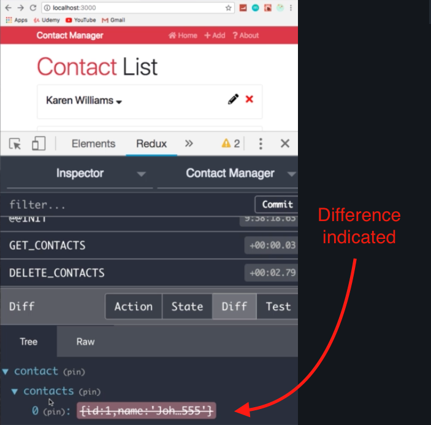

# React Front to Back

## Udemy React Tutorial Notes Section 8: Learning Redux - Part 4 Add and Delete Actions

1. [ Create Add and Delete Actions ](#create-add-and-delete-actions)

<a data="create-add-and-delete-actions"></a>

### **Create Add and Delete Actions**

1. Start by create new action types, one for `DELETE_CONTACT` and the other for `ADD_CONTACT` in your `types.js` file. See Figure 1 - actions/types.js

##### Figure 1 - actions/types.js

```jsx
export const GET_CONTACTS = 'GET_CONTACTS';
export const DELETE_CONTACTS = 'DELETE_CONTACTS';
export const ADD_CONTACTS = 'ADD_CONTACTS';
```

2. Once you've created new action types, you need to create the actions themselves. Since all of our actions pertain to contacts, we will add actions to `contactActions.js`. See Figure 2 - actions/contactActions.js

    - Notice that the `deleteContact` and `addContact` take in parameters.
      - `deleteContact` will need to know which contact to delete, hence an `id` parameter
      - `addContact` will be sending an object, hence the `contact` parameter
      - Both `deleteContact` and `addContact` also have payloads to account for the parameters.

##### Figure 2 - actions/contactActions.js

```jsx

// BEFORE NEW ACTIONS

import { GET_CONTACTS } from './types';

export const getContacts = () => {
  return {
    type: GET_CONTACTS
  }
}

// AFTER, WITH NEW ACTIONS

import { GET_CONTACTS } from './types';

export const getContacts = () => {
  return {
    type: GET_CONTACTS
  }
}
export const deleteContacts = (id) => {
  return {
    type: DELETE_CONTACT,
    payload: id
  }
}
export const addContacts = (contact) => {
  return {
    type: ADD_CONTACT,
    payload: contact 
  }
}

```

3. Next, we need to implement our newly defined actions into the reducer. See Figure 3 - reducers/contactReducer.js
    - Import your new actions in the import statement
    - Once you've import your new actions, create cases for your actions in the switch statememt.
    - `DELETE_CONTACT`:
      - In `DELETE_CONTACT`, we want to return the initial state and then filter out the contact that has the ID that is in the action payload.
    - `ADD_CONTACT` :
      - `ADD_CONTACT` will return the initial state and add the object in the `ADD_CONTACT` payload to the inital state (and remember that contacts is an array, which is why we're using square brackets).

##### Figure 3 - reducers/contactReducer.js

```jsx
import { GET_CONTACTS, DELETE_CONTACT, ADD_CONTACT } from '../actions/types'

const initialState = {
  contacts: [
    {
      id: 1,
      name: 'John Doe',
      email: 'john@gmail.com',
      phone: '555-555-5555'
    },
    {
      id: 2,
      name: 'Karen Williams',
      email: 'karen@gmail.com',
      phone: '444-444-4444'
    },
    {
      id: 3,
      name: 'Henry Johnson',
      email: 'henry@gmail.com',
      phone: '333-333-333'
    }
  ]
};

export default function (state = initialState, action) {
  switch (action.type) {
    case GET_CONTACTS:
      return {
        ...state
      }
    case DELETE_CONTACT:
      return {
        ...state,
        contacts: state.contacts.filter(contact => contact.id !== action.payload)
      }
    case ADD_CONTACT:
      return {
        ...state,
        contacts: [action.payload, ...state.contacts]
      }
    default:
      return state;
  }
}
```

Once the actions have been defined in the `contactReducer.js`, now we need to call these actions from somewhere.

4. Implementing `DELETE_CONTACT`:
  - Deleting a contact happens at the component level. So go to `src/components/contacts/Contact.js`
    - The first thing we need to do in `Contacts.js` is connect it to redux. Add `import { connect } from 'react-redux`.
    - Second, we need to import the actions. Add `import { deleteContact } from '../../actions/contactActions'` 
    - Go to the bottom of the component and adjust the export statement. Whenever you use `connect` from `react-redux`, you need to export `connect()(ComponentGoesHere)`. See Figure 4 - Contacts.js
    - In this situation, all we're doing is calling an action, we're not mapping state to props (we're not bringing any data in from the state), so the first parameter of `connect()` is going to be `null`. However we do need to specify which action we are connecting to. For this reason, the second parameter of `connect` takes in the actions to-be-used with the component. In our case, we are using the `deleteContact` action. Therefore, add `{ deleteContact }` as the second parameter of `connect()`. See Figure 4 - Contacts.js
    - `deleteContact` is a property, so do add it as a `propType`.
    - Lastly, we need to call `deleteContact` and this is done with our event listener `onDeleteClick`. Inside `onDeleteClick`, add `this.props.deleteContact(id)`;


##### Figure 4 - Contacts.js

```jsx
import React, { Component } from 'react';
import { Link } from 'react-router-dom';
import propTypes from 'prop-types';
import { connect } from 'react-redux';
import { deleteContact } from '../../actions/contactActions'

class Contact extends Component {
  state = {
    showContactInfo: false
  };

  onDeleteClick = id => {
    this.props.deleteContact(id)
  };

  render() {
    const { id, name, email, phone } = this.props.contact;
    const { showContactInfo } = this.state;

    return (
      <div className="card card-body mb-3">
        <h4>
          {name}{' '}
          <i
            onClick={() =>
              this.setState({
                showContactInfo: !this.state.showContactInfo
              })
            }
            className="fas fa-sort-down"
            style={{ cursor: 'pointer' }}
          />
          <i
            className="fas fa-times"
            style={{ cursor: 'pointer', float: 'right', color: 'red' }}
            onClick={this.onDeleteClick.bind(this, id)}
          />
          <Link to={`contact/edit/${id}`}>
            <i
              className="fas fa-pencil-alt"
              style={{
                cursor: 'pointer',
                float: 'right',
                color: 'black',
                marginRight: '1rem'
              }}
            />
          </Link>
        </h4>
        {showContactInfo ? (
          <ul className="list-group">
            <li className="list-group-item">Email: {email}</li>
            <li className="list-group-item">Phone: {phone}</li>
          </ul>
        ) : null}
      </div>
    );
  }
}

Contact.propTypes = {
  contact: propTypes.object.isRequired,
  deleteContact: propTypes.func.isRequired
};

export default connect(null, { deleteContact })(Contact);
```

##### Figure 5 - Diff in Redux Dev Tools

Open Redux dev tools and open the Diff tab to see the difference once a contact has been deleted.




4. Implementing `ADD_CONTACT`:
  - Adding a contact happens in its own component, so go to `AddContact.js` and import:
     - `import propTypes from 'prop-types';`
     - `import { connect } from 'react-redux';`
     - `import { addContact } from '../../actions/contactActions'`
  - Next, step up exporting with `connect` as done previously.
    - `export default connect(null , { addContact })(AddContact);`
    - Similarly to `deleteContact`, all `addContact` is doing is calling an action, we're not mapping state to props (we're not bringing any data in from the state), so the first parameter of `connect()` is going to be `null` for `addContact` as well.
  - Add `propTypes` checking. See Figure 6 - AddContact.js
  - Since at this stage of the tutorial, we are not using JSON placeholder yet, we need to bring in `uuid` and add it to the `newContact` object.
    - Add `import uuid from 'uuid'`
    - Add `uuid()` to `const newContact`
  - Once we have an `id` in `newContact`, we can pass in the `newContact` object to our action with `this.props.addContact(newContact);`


##### Figure 6 - AddContact.js

```jsx
import React, { Component } from 'react';
import TextInputGroup from '../layouts/TextInputGroup';
import propTypes from 'prop-types';
import { connect } from 'react-redux';
import { addContact } from '../../actions/contactActions'
import uuid from 'uuid'

class AddContact extends Component {
  state = {
    name: '',
    email: '',
    phone: '',
    errors: {}
  };

  onSubmit = (e) => {
    e.preventDefault();

    const { name, email, phone } = this.state;

    // Check For Errors
    if (name === '') {
      this.setState({ errors: { name: 'Name is required' } });
      return;
    }

    if (email === '') {
      this.setState({ errors: { email: 'Email is required' } });
      return;
    }

    if (phone === '') {
      this.setState({ errors: { phone: 'Phone is required' } });
      return;
    }

    const newContact = {
      id: uuid(),
      name,
      email,
      phone
    };

    this.props.addContact(newContact);

    // Clear State
    this.setState({
      name: '',
      email: '',
      phone: '',
      errors: {}
    });

    this.props.history.push('/');
  };

  onChange = e => this.setState({ [e.target.name]: e.target.value });

  render() {
    const { name, email, phone, errors } = this.state;

    return (
      <div className="card mb-3">
        <div className="card-header">Add Contact</div>
        <div className="card-body">
          <form onSubmit={this.onSubmit}>
            <TextInputGroup
              label="Name"
              name="name"
              placeholder="Enter Name"
              value={name}
              onChange={this.onChange}
              error={errors.name}
            />
            <TextInputGroup
              label="Email"
              name="email"
              type="email"
              placeholder="Enter Email"
              value={email}
              onChange={this.onChange}
              error={errors.email}
            />
            <TextInputGroup
              label="Phone"
              name="phone"
              placeholder="Enter Phone"
              value={phone}
              onChange={this.onChange}
              error={errors.phone}
            />
            <input
              type="submit"
              value="Add Contact"
              className="btn btn-light btn-block"
            />
          </form>
        </div>
      </div>
    );
  }
}

AddContact.propTypes = {
  addContact: propTypes.func.isRequired
}

export default connect(null, { addContact })(AddContact);
```