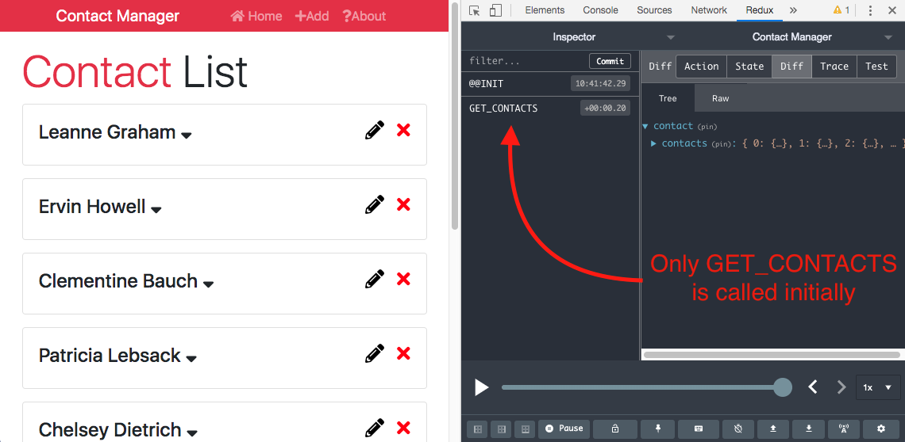
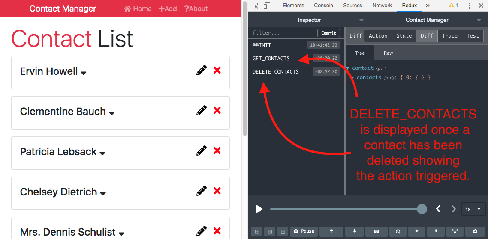
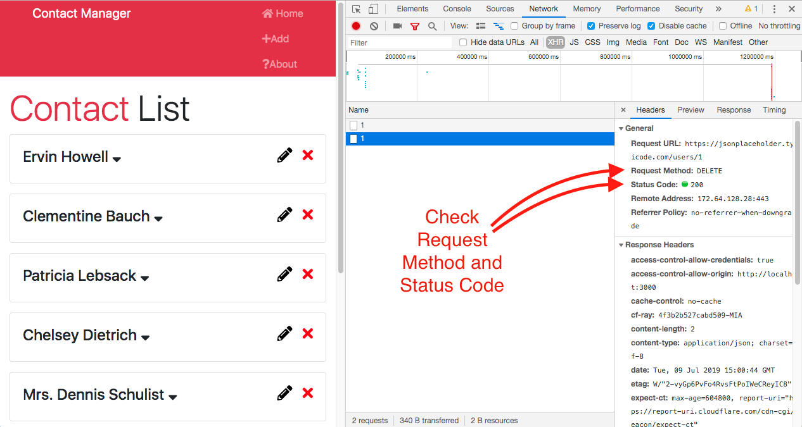

# React Front to Back

## Udemy React Tutorial Notes Section 9: Learning Redux - Part 1 Add and Delete Actions

1. [ From Hardcoded State to Using GET Request with axios ](#from-hardcoded-state-to-using-get-request-with-axios)
2. [ DELETE POST Request ](#delete-post-request)
3. [ ADD POST Request ](#add-post-request)
4. [ Try Catch for Deleting Newly Added Contact ](#try-catch-for-deleting-newly-added-contact)

<a data="from-hardcoded-state-to-using-get-request-with-axios"></a>

### **From Hardcoded State to Using GET Request with axios**

1. In `reducers/contactReducer.js`, delete the hardcoded state.

```jsx

// Before

import { GET_CONTACTS, DELETE_CONTACT, ADD_CONTACT } from '../actions/types'

const initialState = {
  contacts: [
    {
      id: 1,
      name: 'John Doe',
      email: 'john@gmail.com',
      phone: '555-555-5555'
    },
    {
      id: 2,
      name: 'Karen Williams',
      email: 'karen@gmail.com',
      phone: '444-444-4444'
    },
    {
      id: 3,
      name: 'Henry Johnson',
      email: 'henry@gmail.com',
      phone: '333-333-333'
    }
  ]
};

export default function (state = initialState, action) {
  switch (action.type) {
    case GET_CONTACTS:
      return {
        ...state
      }
    case DELETE_CONTACT:
      return {
        ...state,
        contacts: state.contacts.filter(contact => contact.id !== action.payload)
      }
    case ADD_CONTACT:
      return {
        ...state,
        contacts: [action.payload, ...state.contacts]
      }
    default:
      return state;
  }
}

// After

import { GET_CONTACTS, DELETE_CONTACT, ADD_CONTACT } from '../actions/types'

const initialState = {
  contacts: []
};

export default function (state = initialState, action) {
  switch (action.type) {
    case GET_CONTACTS:
      return {
        ...state
      }
    case DELETE_CONTACT:
      return {
        ...state,
        contacts: state.contacts.filter(contact => contact.id !== action.payload)
      }
    case ADD_CONTACT:
      return {
        ...state,
        contacts: [action.payload, ...state.contacts]
      }
    default:
      return state;
  }
}
```

2. Once you've deleted the hardcoded state in our reducer, it's in our `contactAction.js` where we want to make our request. Specifically the `getContacts()` function. 
    - In order to make a request with `getContacts()`, we need to call dispatch.
    - When using `dispatch`, we need to replace `return` with `dispatch` and wrap the type object in a `dispatch` method.
    - Above `dispatch` is where to make our request to JSON placeholder. First we need to get the response and then we need to add that as a payload to get the contacts.
    - Import `axios` to make our request to JSON placeholder.
    - For this type of call, it's best to use `async await`. To do this, add `async` before `dispatch` in the second parameter set.
    - Create a variable called `res`, set it to `await`, and then use `axios` to get contacts from the JSON placeholder API.
    - We will be able to access the `axios` response data as it will be stored in our `res` variable. This data is accessible with `res.data`.
    - Add a payload after the `type` declaration and set it to `res.data`

```jsx

//Before

import { GET_CONTACTS, DELETE_CONTACT, ADD_CONTACT } from './types';

export const getContacts = () => {
  return {
    type: GET_CONTACTS
  }
}
export const deleteContact = (id) => {
  return {
    type: DELETE_CONTACT,
    payload: id
  }
}
export const addContact = (contact) => {
  return {
    type: ADD_CONTACT,
    payload: contact
  }
}

//After

import { GET_CONTACTS, DELETE_CONTACT, ADD_CONTACT } from './types';
import axios from 'axios'

export const getContacts = () => async dispatch => {
  const res = await axios.get('https://jsonplaceholder.typicode.com/users')
  dispatch({
    type: GET_CONTACTS,
    payload: res.data
  })
}
export const deleteContact = (id) => {
  return {
    type: DELETE_CONTACT,
    payload: id
  }
}
export const addContact = (contact) => {
  return {
    type: ADD_CONTACT,
    payload: contact
  }
}

```

3. Next we need to adjust `GET_CONTACTS` in `contactReducer.js` from just to returning the initial state to returning the initial state with the `payload`. 
    - In the return statement, add a comma after `...state` and set `contacts` equal to the action and its payload.


```jsx

// Before

import { GET_CONTACTS, DELETE_CONTACT, ADD_CONTACT } from '../actions/types'

const initialState = {
  contacts: []
};

export default function (state = initialState, action) {
  switch (action.type) {
    case GET_CONTACTS:
      return {
        ...state
      }
    case DELETE_CONTACT:
      return {
        ...state,
        contacts: state.contacts.filter(contact => contact.id !== action.payload)
      }
    case ADD_CONTACT:
      return {
        ...state,
        contacts: [action.payload, ...state.contacts]
      }
    default:
      return state;
  }
}

// After

import { GET_CONTACTS, DELETE_CONTACT, ADD_CONTACT } from '../actions/types'

const initialState = {
  contacts: []
};

export default function (state = initialState, action) {
  switch (action.type) {
    case GET_CONTACTS:
      return {
        ...state,
        contacts: action.payload
      }
    case DELETE_CONTACT:
      return {
        ...state,
        contacts: state.contacts.filter(contact => contact.id !== action.payload)
      }
    case ADD_CONTACT:
      return {
        ...state,
        contacts: [action.payload, ...state.contacts]
      }
    default:
      return state;
  }
}
```

<a data="delete-post-request"></a>

### **DELETE POST Request**

1.  - Similar to `GET_CONTACTS`, bring in `dispatch` and make the function `async` in `contactActions.js`
    - Unlike `GET_CONTACTS`, we don't need to put anything into a variable. Therefore add `await axios.delete()` directly. 
    - Inside the `axios.delete()` method, add backticks because we will need to add a dynamic `id`.
    - Lastly we need to define our `dispatch`, as we've done with `GET_CONTACTS`. Replace `return` with `dispatch` and wrap the type object in `dispatch`.

```jsx

// Before

import { GET_CONTACTS, DELETE_CONTACT, ADD_CONTACT } from './types';
import axios from 'axios'

export const getContacts = () => async dispatch => {
  const res = await axios.get('https://jsonplaceholder.typicode.com/users')
  dispatch({
    type: GET_CONTACTS,
    payload: res.data
  })
}
export const deleteContact = (id) => {
  return {
    type: DELETE_CONTACT,
    payload: id
  }
}
export const addContact = (contact) => {
  return {
    type: ADD_CONTACT,
    payload: contact
  }
}

// After

import { GET_CONTACTS, DELETE_CONTACT, ADD_CONTACT } from './types';
import axios from 'axios'

export const getContacts = () => async dispatch => {
  const res = await axios.get('https://jsonplaceholder.typicode.com/users')
  dispatch({
    type: GET_CONTACTS,
    payload: res.data
  })
}
export const deleteContact = (id) => async dispatch => {
  await axios.delete(`https://jsonplaceholder.typicode.com/users/${id}`);
  dispatch({
    type: DELETE_CONTACT,
    payload: id
  })
}
export const addContact = (contact) => {
  return {
    type: ADD_CONTACT,
    payload: contact
  }
}

```

You can check to see if your action is being called with Redux dev tools. Figure 1 - Prior to calling `DELETE ACTIONS`, shows that only `GET_CONTACTS` is getting called. Once a contact is deleted, the additional action (or actions) that's been called is visible in the order that the action has been called. See Figure 2 - After `DELETE CONTACT` is called.

##### Figure 1 - Prior to calling `DELETE ACTIONS`



##### Figure 2 - After `DELETE CONTACT` is called



Whenever you're making an HTTP request, it's also always important to check the Network tab in your console. See Figure 3 - Network Tab
  - Go to Network. 
  - Check to see that you're Request Method is the right one
  - Make sure you're gettong a Status Code of 200

##### Figure 3 - Figure 3 - Network Tab




<a data="add-post-request"></a>

### **ADD POST Request**

1.  - Go to `contactActions.js` and adjust `AddContact()` similarly to how we adjusted `getContacts()` and `deleteContact()`.
    - add `async dispatch` as a second parameter set and replace `return` with `dispatch` and wrap the type object in `dispatch`.
    - Unlike `deleteContact`, we do need to store the axios response to a variable as we need to pass the data of the response to the payload.
    - Adjust the payload from being set to the contact object to being set to the data of the response. From `payload: contact` to  `payload: res.data`.
    - Next, since JSON placeholder will return an id, we need to adjust `AddContact.js` from `uuid` to not using `uuid`. See Figure 4 - `AddContact.js`


```jsx 

// Before

import { GET_CONTACTS, DELETE_CONTACT, ADD_CONTACT } from './types';
import axios from 'axios'

export const getContacts = () => async dispatch => {
  const res = await axios.get('https://jsonplaceholder.typicode.com/users')
  dispatch({
    type: GET_CONTACTS,
    payload: res.data
  })
}
export const deleteContact = (id) => async dispatch => {
  await axios.delete(`https://jsonplaceholder.typicode.com/users/${id}`);
  dispatch({
    type: DELETE_CONTACT,
    payload: id
  })
}
export const addContact = (contact) => {
  return {
    type: ADD_CONTACT,
    payload: contact
  }
}

// After

import { GET_CONTACTS, DELETE_CONTACT, ADD_CONTACT } from './types';
import axios from 'axios'

export const getContacts = () => async dispatch => {
  const res = await axios.get('https://jsonplaceholder.typicode.com/users')
  dispatch({
    type: GET_CONTACTS,
    payload: res.data
  })
}
export const deleteContact = (id) => async dispatch => {
  await axios.delete(`https://jsonplaceholder.typicode.com/users/${id}`);
  dispatch({
    type: DELETE_CONTACT,
    payload: id
  })
}
export const addContact = (contact) => async dispatch => {
  const res = await axios.post('https://jsonplaceholder.typicode.com/users/', contact)
  dispatch({
    type: ADD_CONTACT,
    payload: res.data
  })
}

```


##### Figure 4 - `AddContact.js`


```jsx

// Before

import React, { Component } from 'react';
import TextInputGroup from '../layouts/TextInputGroup';
import propTypes from 'prop-types';
import { connect } from 'react-redux';
import { addContact } from '../../actions/contactActions'
import uuid from 'uuid'

class AddContact extends Component {
  state = {
    name: '',
    email: '',
    phone: '',
    errors: {}
  };

  onSubmit = (e) => {
    e.preventDefault();

    const { name, email, phone } = this.state;

    // Check For Errors
    if (name === '') {
      this.setState({ errors: { name: 'Name is required' } });
      return;
    }

    if (email === '') {
      this.setState({ errors: { email: 'Email is required' } });
      return;
    }

    if (phone === '') {
      this.setState({ errors: { phone: 'Phone is required' } });
      return;
    }

    const newContact = {
      id: uuid(),
      name,
      email,
      phone
    };

    this.props.addContact(newContact);

    // Clear State
    this.setState({
      name: '',
      email: '',
      phone: '',
      errors: {}
    });

    this.props.history.push('/');
  };

  onChange = e => this.setState({ [e.target.name]: e.target.value });

  render() {
    const { name, email, phone, errors } = this.state;

    return (
      <div className="card mb-3">
        <div className="card-header">Add Contact</div>
        <div className="card-body">
          <form onSubmit={this.onSubmit}>
            <TextInputGroup
              label="Name"
              name="name"
              placeholder="Enter Name"
              value={name}
              onChange={this.onChange}
              error={errors.name}
            />
            <TextInputGroup
              label="Email"
              name="email"
              type="email"
              placeholder="Enter Email"
              value={email}
              onChange={this.onChange}
              error={errors.email}
            />
            <TextInputGroup
              label="Phone"
              name="phone"
              placeholder="Enter Phone"
              value={phone}
              onChange={this.onChange}
              error={errors.phone}
            />
            <input
              type="submit"
              value="Add Contact"
              className="btn btn-light btn-block"
            />
          </form>
        </div>
      </div>
    );
  }
}

AddContact.propTypes = {
  addContact: propTypes.func.isRequired
}

export default connect(null, { addContact })(AddContact);


// After

import React, { Component } from 'react';
import TextInputGroup from '../layouts/TextInputGroup';
import propTypes from 'prop-types';
import { connect } from 'react-redux';
import { addContact } from '../../actions/contactActions'

class AddContact extends Component {
  state = {
    name: '',
    email: '',
    phone: '',
    errors: {}
  };

  onSubmit = (e) => {
    e.preventDefault();

    const { name, email, phone } = this.state;

    // Check For Errors
    if (name === '') {
      this.setState({ errors: { name: 'Name is required' } });
      return;
    }

    if (email === '') {
      this.setState({ errors: { email: 'Email is required' } });
      return;
    }

    if (phone === '') {
      this.setState({ errors: { phone: 'Phone is required' } });
      return;
    }

    const newContact = {
      name,
      email,
      phone
    };

    this.props.addContact(newContact);

    // Clear State
    this.setState({
      name: '',
      email: '',
      phone: '',
      errors: {}
    });

    this.props.history.push('/');
  };

  onChange = e => this.setState({ [e.target.name]: e.target.value });

  render() {
    const { name, email, phone, errors } = this.state;

    return (
      <div className="card mb-3">
        <div className="card-header">Add Contact</div>
        <div className="card-body">
          <form onSubmit={this.onSubmit}>
            <TextInputGroup
              label="Name"
              name="name"
              placeholder="Enter Name"
              value={name}
              onChange={this.onChange}
              error={errors.name}
            />
            <TextInputGroup
              label="Email"
              name="email"
              type="email"
              placeholder="Enter Email"
              value={email}
              onChange={this.onChange}
              error={errors.email}
            />
            <TextInputGroup
              label="Phone"
              name="phone"
              placeholder="Enter Phone"
              value={phone}
              onChange={this.onChange}
              error={errors.phone}
            />
            <input
              type="submit"
              value="Add Contact"
              className="btn btn-light btn-block"
            />
          </form>
        </div>
      </div>
    );
  }
}

AddContact.propTypes = {
  addContact: propTypes.func.isRequired
}

export default connect(null, { addContact })(AddContact);

```


<a data="try-catch-for-deleting-newly-added-contact"></a>

### **Try Catch for Deleting Newly Added Contact**

Right now in our application, we are not able to delete a contact we've recently added because we are making POST requests to a fake REST API and that contact doesn't exist in the JSON placeholder API server. In order to fix this, add an `try catch` in `deleteContact`.

```jsx 

// Before

export const deleteContact = (id) => async dispatch => {
  await axios.delete(`https://jsonplaceholder.typicode.com/users/${id}`);
  dispatch({
    type: DELETE_CONTACT,
    payload: id
  })
}

// After

export const deleteContact = (id) => async dispatch => {
  try {
    await axios.delete(`https://jsonplaceholder.typicode.com/users/${id}`);
    dispatch({
      type: DELETE_CONTACT,
      payload: id
    })
  }
  catch (e) {
    dispatch({
      type: DELETE_CONTACT,
      payload: id
    })
  }
}
```