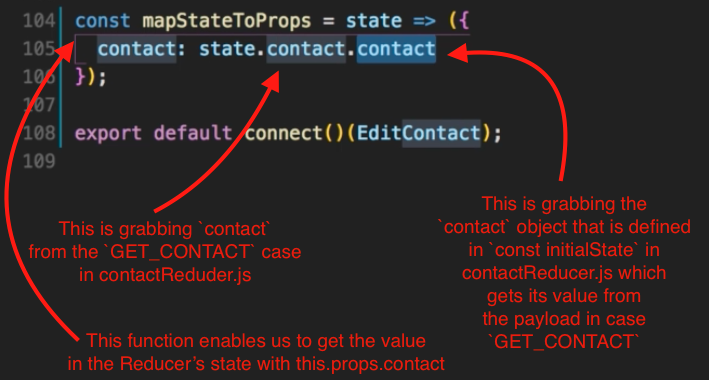
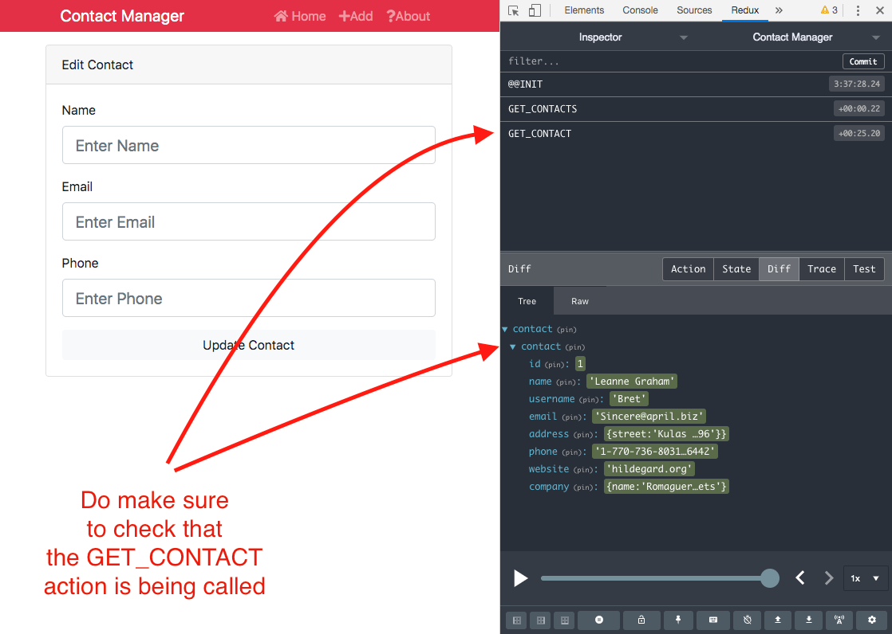
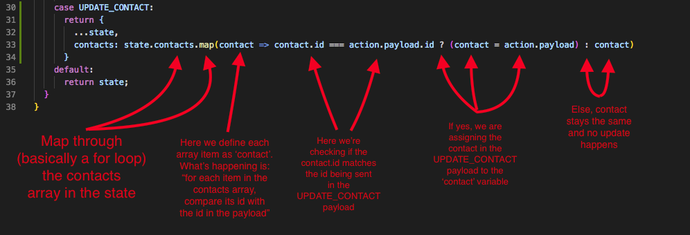

# React Front to Back

## Udemy React Tutorial Notes Section 9: Learning Redux - Part 2 Edit Contact

1. [ GET single contact for EditContact.js ](#GET-single-contact-for-EditContact.js)
2. [ Fill Form Fields from Redux State ](#fill-form-fields-from-redux-state)
3. [ PUT Request ](#put-request)

<a data="GET-single-contact-for-EditContact.js"></a>

### **GET single contact for EditContact.js**

1. The first thing we need to do build the functionality of editing a contact is to create an action type for updating a contact.
    - Go to `src/actions/types.js`
    - There we'll need to add 2 new types, one for getting an individual contact, and the other for updating the contact.
    - See Figure 1 - `types.js`

##### Figure 1 - `types.js`

```jsx
export const GET_CONTACTS = 'GET_CONTACTS';
export const DELETE_CONTACT = 'DELETE_CONTACTS';
export const ADD_CONTACT = 'ADD_CONTACTS';
export const GET_CONTACT = 'GET_CONTACT';
export const UPDATE_CONTACT = 'UPDATE_CONTACTS';
```

2. Next, we need to go to `contactActions.js` and create an action that will fetch a single contact.
    - Below `getContacts`, create a `const getContact` (copy `getContacts` as the functions will be very similar)
    - `getContact` will be an `id` as a parameter.
    - replace standard quotes in the `axios` call to backticks so we can pass a dynamic `id` in the url.
    - Adjust the type in `dispatch` from `GET_CONTACTS` to `GET_CONTACT`
    - Make sure you bring in `GET_CONTACT` from `types.js` in our `import` statement. (At this point, also bring in `UPDATE_CONTACT`).
    - See Figure 2 - `contactActions.js`

##### Figure 2 - `contactActions.js`

```jsx
import { GET_CONTACTS, DELETE_CONTACT, ADD_CONTACT, GET_CONTACT, UPDATE_CONTACT } from './types';
import axios from 'axios'

export const getContacts = () => async dispatch => {
  const res = await axios.get('https://jsonplaceholder.typicode.com/users')
  dispatch({
    type: GET_CONTACTS,
    payload: res.data
  })
}
export const getContact = (id) => async dispatch => {
  const res = await axios.get(`https://jsonplaceholder.typicode.com/users/${id}`)
  dispatch({
    type: GET_CONTACT,
    payload: res.data
  })
}
export const deleteContact = (id) => async dispatch => {
  try {
    await axios.delete(`https://jsonplaceholder.typicode.com/users/${id}`);
    dispatch({
      type: DELETE_CONTACT,
      payload: id
    })
  }
  catch (e) {
    dispatch({
      type: DELETE_CONTACT,
      payload: id
    })
  }
}
export const addContact = (contact) => async dispatch => {
  const res = await axios.post('https://jsonplaceholder.typicode.com/users/', contact)
  dispatch({
    type: ADD_CONTACT,
    payload: res.data
  })
}
```

3. Next we need to create a `case` in our `switch` statement to account for `GET_CONTACT`.
    - Go to `reducers/contactReducer.js`
    - Update the import state to: `import { GET_CONTACTS, DELETE_CONTACT, ADD_CONTACT, GET_CONTACT, UPDATE_CONTACT } from '../actions/types'`
    - Copy `case GET_CONTACTS` below `case GET_CONTACTS`
    - Change the state value that is called `contacts` to just `contact` in the `return` statement of case `GET_CONTACT`
    -  `contact` will end up being an object that we will fill that with the payload.
    - Lastly, you need to adjust the `const initialState` object to also contain `contact`, which will be an empty object. That empty object will be filled with the payload from the `GET_CONTACT` action.
    - See Figure 3 - `contactReducer.js`

##### Figure 3 - `contactReducer.js`

```jsx
import { GET_CONTACTS, DELETE_CONTACT, ADD_CONTACT, GET_CONTACT, UPDATE_CONTACT } from '../actions/types'

const initialState = {
  contacts: [],
  contact: {}
};

export default function (state = initialState, action) {
  switch (action.type) {
    case GET_CONTACTS:
      return {
        ...state,
        contacts: action.payload
      }
    case GET_CONTACT:
      return {
        ...state,
        contact: action.payload
      }
    case DELETE_CONTACT:
      return {
        ...state,
        contacts: state.contacts.filter(contact => contact.id !== action.payload)
      }
    case ADD_CONTACT:
      return {
        ...state,
        contacts: [action.payload, ...state.contacts]
      }
    default:
      return state;
  }
}
```

4. Next we need to call `GET_CONTACT` and have it fill out Edit Contact Form.
    - Go to the form, which is in `components/EditContact.js`
    - Import the following modules:
      - Bring in `propTypes` because actions are sent as a property in `connect()` from `react-redux`.
      - Bring in `connect`
      - Your action, so `import { getContact } from '../../actions/contactActions'`
      - Next you need to `export connect()(EditContact.js)`
      - In this situation, we're going to want to map our state to props because the state in `contactReducer.js` contains the `contact` object and we will need that value in our Edit Contact form.
        - Create a `const mapStateToProps` that takes `state` as a parameter.
        - We need to apply the value in the state in `contactReducer.js` (where we defined `contact` as an empty object) to the property of `EditContact.js`. See Figure 4 - `mapStateToProps` in EditContact.js
      - Recall that you need to add 2 parameters in `connect()`
        - The first is your `mapStatetoProps` function
        - The second is the action or actions needed in the component.
        - In our case, connect with look like: `connect(mapStateToProps, { getContact })(EditContact)`
      - Define your `propTypes`.
        - First define `getContact` for passing it to `connect` as a parameter.
        - Second define `contact` for passing it as a part of `mapStateToProps`.
      - We need to call `getContact` because that's what's going to bring the single contact. 
        - For this, it's best to use `componentDidMount()`
        - Inside `componentDidMount()` create a `const` to store the contact `id` which we will get from the url. For that use `const { id } = this.props.match.params`.
        - Then you just need to call `getContact` and pass in the `id` like so: `this.props.getContact(id)`
        - Always check the redux dev tools to see that you're calling the action you intend to. See Figure 5 - getContact action in Redux dev tools.
      - See Figure 6 - EditContact.js

##### Figure 4 - `mapStateToProps` in EditContact.js



##### Figure 5 - getContact action in Redux dev tools.



##### Figure 6 - EditContact.js

```jsx
import React, { Component } from 'react';
import TextInputGroup from '../layouts/TextInputGroup';
import propTypes from 'prop-types';
import { connect } from 'react-redux';
import { getContact } from '../../actions/contactActions'

class EditContact extends Component {
  state = {
    name: '',
    email: '',
    phone: '',
    errors: {}
  };

  componentDidMount() {
    const { id } = this.props.match.params;
    this.props.getContact(id);
  }

  onSubmit = (e) => {
    e.preventDefault();

    const { name, email, phone } = this.state;

    // Check For Errors
    if (name === '') {
      this.setState({ errors: { name: 'Name is required' } });
      return;
    }

    if (email === '') {
      this.setState({ errors: { email: 'Email is required' } });
      return;
    }

    if (phone === '') {
      this.setState({ errors: { phone: 'Phone is required' } });
      return;
    }

    const updContact = {
      name,
      email,
      phone
    };

    //// UPDATE CONTACT ////

    // Clear State
    this.setState({
      name: '',
      email: '',
      phone: '',
      errors: {}
    });

    this.props.history.push('/');
  };

  onChange = e => this.setState({ [e.target.name]: e.target.value });

  render() {
    const { name, email, phone, errors } = this.state;

    return (
      <div className="card mb-3">
        <div className="card-header">Edit Contact</div>
        <div className="card-body">
          <form onSubmit={this.onSubmit}>
            <TextInputGroup
              label="Name"
              name="name"
              placeholder="Enter Name"
              value={name}
              onChange={this.onChange}
              error={errors.name}
            />
            <TextInputGroup
              label="Email"
              name="email"
              type="email"
              placeholder="Enter Email"
              value={email}
              onChange={this.onChange}
              error={errors.email}
            />
            <TextInputGroup
              label="Phone"
              name="phone"
              placeholder="Enter Phone"
              value={phone}
              onChange={this.onChange}
              error={errors.phone}
            />
            <input
              type="submit"
              value="Update Contact"
              className="btn btn-light btn-block"
            />
          </form>
        </div>
      </div>
    );
  }
}

EditContact.propTypes = {
  contact: propTypes.object.isRequired,
  getContact: propTypes.func.isRequired
}

const mapStateToProps = state => ({
  contact: state.contact.contact
})

export default connect(mapStateToProps, { getContact })(EditContact);
```

<a data="fill-form-fields-from-redux-state"></a>

### **Fill Form Fields from Redux State**


In order to fill the form fields in the Edit Contact form, we need to pass the props of `EditContact.js` into the local state of `EditContacts.js`. What we did in the previous section is basically bind the state in `contactActions.js` to the props of `EditContact.js`. Now we need to bind the props of `EditContact.js` to its local state. To do this, we need to bind the inputs to the state.

1. In order to bind the inputs to the state, it's best to use `componentWillReceiveProps`, which will have to be `UNSAFE_componentWillReceiveProps()`. `UNSAFE_componentWillReceiveProps()` will work until React version 17, and at the time of this tutorial, we are using React version 16.8.6.
    - `UNSAFE_componentWillReceiveProps()` takes 2 parameters.
      - 1st: nextProps
      - 2nd: nextState
    - `UNSAFE_componentWillReceiveProps()` will run when we fetch our data from the state in `contactReducer.js` and map it to props.
      - It is in `nextProps` where we'll be able to access the data we fetch from the state in `contactReducer.js`.
      - Use destructuring to grab the `name`, `email` and `phone` from `nextProps` with `const { name, email, phone } = nextProps.contact`
      - Use `setState` to set the state of `EditContacts.js` with the values you get from destructuring `nextProps`
      - See Figure 7 - EditContact.js

##### Figure 7 - EditContact.js

```jsx
import React, { Component } from 'react';
import TextInputGroup from '../layouts/TextInputGroup';
import propTypes from 'prop-types';
import { connect } from 'react-redux';
import { getContact } from '../../actions/contactActions'

class EditContact extends Component {
  state = {
    name: '',
    email: '',
    phone: '',
    errors: {}
  };

  UNSAFE_componentWillReceiveProps(nextProps, nextState) {
    const { name, email, phone } = nextProps.contact;
    this.setState({
      name,
      email,
      phone
    })
  }

  componentDidMount() {
    const { id } = this.props.match.params;
    this.props.getContact(id);
  }

  onSubmit = (e) => {
    e.preventDefault();

    const { name, email, phone } = this.state;

    // Check For Errors
    if (name === '') {
      this.setState({ errors: { name: 'Name is required' } });
      return;
    }

    if (email === '') {
      this.setState({ errors: { email: 'Email is required' } });
      return;
    }

    if (phone === '') {
      this.setState({ errors: { phone: 'Phone is required' } });
      return;
    }

    const updContact = {
      name,
      email,
      phone
    };

    //// UPDATE CONTACT ////

    // Clear State
    this.setState({
      name: '',
      email: '',
      phone: '',
      errors: {}
    });

    this.props.history.push('/');
  };

  onChange = e => this.setState({ [e.target.name]: e.target.value });

  render() {
    const { name, email, phone, errors } = this.state;

    return (
      <div className="card mb-3">
        <div className="card-header">Edit Contact</div>
        <div className="card-body">
          <form onSubmit={this.onSubmit}>
            <TextInputGroup
              label="Name"
              name="name"
              placeholder="Enter Name"
              value={name}
              onChange={this.onChange}
              error={errors.name}
            />
            <TextInputGroup
              label="Email"
              name="email"
              type="email"
              placeholder="Enter Email"
              value={email}
              onChange={this.onChange}
              error={errors.email}
            />
            <TextInputGroup
              label="Phone"
              name="phone"
              placeholder="Enter Phone"
              value={phone}
              onChange={this.onChange}
              error={errors.phone}
            />
            <input
              type="submit"
              value="Update Contact"
              className="btn btn-light btn-block"
            />
          </form>
        </div>
      </div>
    );
  }
}

EditContact.propTypes = {
  contact: propTypes.object.isRequired,
  getContact: propTypes.func.isRequired
}

const mapStateToProps = state => ({
  contact: state.contact.contact
})

export default connect(mapStateToProps, { getContact })(EditContact);
```

<a data="put-request"></a>

### **PUT Request.js**

- Now all that's left is to finish the `UPDATE_CONTACT` action we started.
1. Add an action in `contactActions.js` for updating a contact.
    - Copy `addContact` and make the following changes:
    - Change the function name from `addContact to updateContact.js`
    - Change the type in dispatch from `ADD_CONTACT` to `UPDATE_CONTACT`
    - Change the axios call from a `post` request to A `put` request.
    - Change the url in the axios call to backticks because we'll need to pass in an `id`
    - For the `id` parameter, get the `id` via the `contact` object with `contact.id`
    - See Figure 8 - `contactActions.js`

##### Figure 8 - `contactActions.js`

```jsx
import { GET_CONTACTS, DELETE_CONTACT, ADD_CONTACT, GET_CONTACT, UPDATE_CONTACT } from './types';
import axios from 'axios'

export const getContacts = () => async dispatch => {
  const res = await axios.get('https://jsonplaceholder.typicode.com/users')
  dispatch({
    type: GET_CONTACTS,
    payload: res.data
  })
}
export const getContact = (id) => async dispatch => {
  const res = await axios.get(`https://jsonplaceholder.typicode.com/users/${id}`)
  dispatch({
    type: GET_CONTACT,
    payload: res.data
  })
}
export const deleteContact = (id) => async dispatch => {
  try {
    await axios.delete(`https://jsonplaceholder.typicode.com/users/${id}`);
    dispatch({
      type: DELETE_CONTACT,
      payload: id
    })
  }
  catch (e) {
    dispatch({
      type: DELETE_CONTACT,
      payload: id
    })
  }
}
export const addContact = (contact) => async dispatch => {
  const res = await axios.post('https://jsonplaceholder.typicode.com/users/', contact)
  dispatch({
    type: ADD_CONTACT,
    payload: res.data
  })
}
export const updateContact = (contact) => async dispatch => {
  const res = await axios.put(`https://jsonplaceholder.typicode.com/users/${contact.id}`, contact)
  dispatch({
    type: UPDATE_CONTACT,
    payload: res.data
  })
}
```

2. Now we need to create a case for `UPDATE_CONTACT` in `contactReducer.js`
    - Inside the `return` statement, we get the initial state.
    - Then we re-assign the `contacts` variable to a mapped version of the `contacts` in state using a ternary.
    - See Figure 9 - `UPDATE_CONTACT` return statement
    - See Figure 10 - `contactReducer.js` for full file after `UPDATE_CONTACT` definition.

##### Figure 9 - `UPDATE_CONTACT` return statement



##### Figure 10 - `contactReducer.js`

```jsx
import { GET_CONTACTS, DELETE_CONTACT, ADD_CONTACT, GET_CONTACT, UPDATE_CONTACT } from '../actions/types'

const initialState = {
  contacts: [],
  contact: {}
};

export default function (state = initialState, action) {
  switch (action.type) {
    case GET_CONTACTS:
      return {
        ...state,
        contacts: action.payload
      }
    case GET_CONTACT:
      return {
        ...state,
        contact: action.payload
      }
    case DELETE_CONTACT:
      return {
        ...state,
        contacts: state.contacts.filter(contact => contact.id !== action.payload)
      }
    case ADD_CONTACT:
      return {
        ...state,
        contacts: [action.payload, ...state.contacts]
      }
    case UPDATE_CONTACT:
      return {
        ...state,
        contacts: state.contacts.map(contact => contact.id === action.payload.id ? (contact = action.payload) : contact)
      }
    default:
      return state;
  }
}
```

3. Next we need to implement `UPDATE_CONTACT` into our `EditContact.js` component.
    - In `EditContact.js`, beside `getContact` in our import statement, add `updateContact` with `import { getContact, updateContact } from '../../actions/contactActions'`
    - Once you've imported `updateContact`, add `updateContact` to the `export` statement in the second parameter of `connect`.
    - Add `updateContact` as a required proptype.
    - Get the `id` from the url with `const { id } = this.props.match.params;` and add it to a `const updContact`, which is an object that holds the values of the updated contact.
    - Then call the `updateContact` action and pass in `updContact`

```jsx
import React, { Component } from 'react';
import TextInputGroup from '../layouts/TextInputGroup';
import propTypes from 'prop-types';
import { connect } from 'react-redux';
import { getContact, updateContact } from '../../actions/contactActions'

class EditContact extends Component {
  state = {
    name: '',
    email: '',
    phone: '',
    errors: {}
  };

  UNSAFE_componentWillReceiveProps(nextProps, nextState) {
    const { name, email, phone } = nextProps.contact;
    this.setState({
      name,
      email,
      phone
    });
  }

  componentDidMount() {
    const { id } = this.props.match.params;
    this.props.getContact(id);
  }

  onSubmit = (e) => {
    e.preventDefault();

    const { name, email, phone } = this.state;

    // Check For Errors
    if (name === '') {
      this.setState({ errors: { name: 'Name is required' } });
      return;
    }

    if (email === '') {
      this.setState({ errors: { email: 'Email is required' } });
      return;
    }

    if (phone === '') {
      this.setState({ errors: { phone: 'Phone is required' } });
      return;
    }

    const { id } = this.props.match.params;

    const updContact = {
      id,
      name,
      email,
      phone
    };

    console.log(updContact);

    this.props.updateContact(updContact);

    // Clear State
    this.setState({
      name: '',
      email: '',
      phone: '',
      errors: {}
    });

    this.props.history.push('/');
  };

  onChange = e => this.setState({ [e.target.name]: e.target.value });

  render() {
    const { name, email, phone, errors } = this.state;

    return (
      <div className="card mb-3">
        <div className="card-header">Edit Contact</div>
        <div className="card-body">
          <form onSubmit={this.onSubmit}>
            <TextInputGroup
              label="Name"
              name="name"
              placeholder="Enter Name"
              value={name}
              onChange={this.onChange}
              error={errors.name}
            />
            <TextInputGroup
              label="Email"
              name="email"
              type="email"
              placeholder="Enter Email"
              value={email}
              onChange={this.onChange}
              error={errors.email}
            />
            <TextInputGroup
              label="Phone"
              name="phone"
              placeholder="Enter Phone"
              value={phone}
              onChange={this.onChange}
              error={errors.phone}
            />
            <input
              type="submit"
              value="Update Contact"
              className="btn btn-light btn-block"
            />
          </form>
        </div>
      </div>
    );
  }
}

EditContact.propTypes = {
  contact: propTypes.object.isRequired,
  getContact: propTypes.func.isRequired,
  updateContact: propTypes.func.isRequired
}

const mapStateToProps = state => ({
  contact: state.contact.contact
})


export default connect(mapStateToProps, { getContact, updateContact })(EditContact);
```