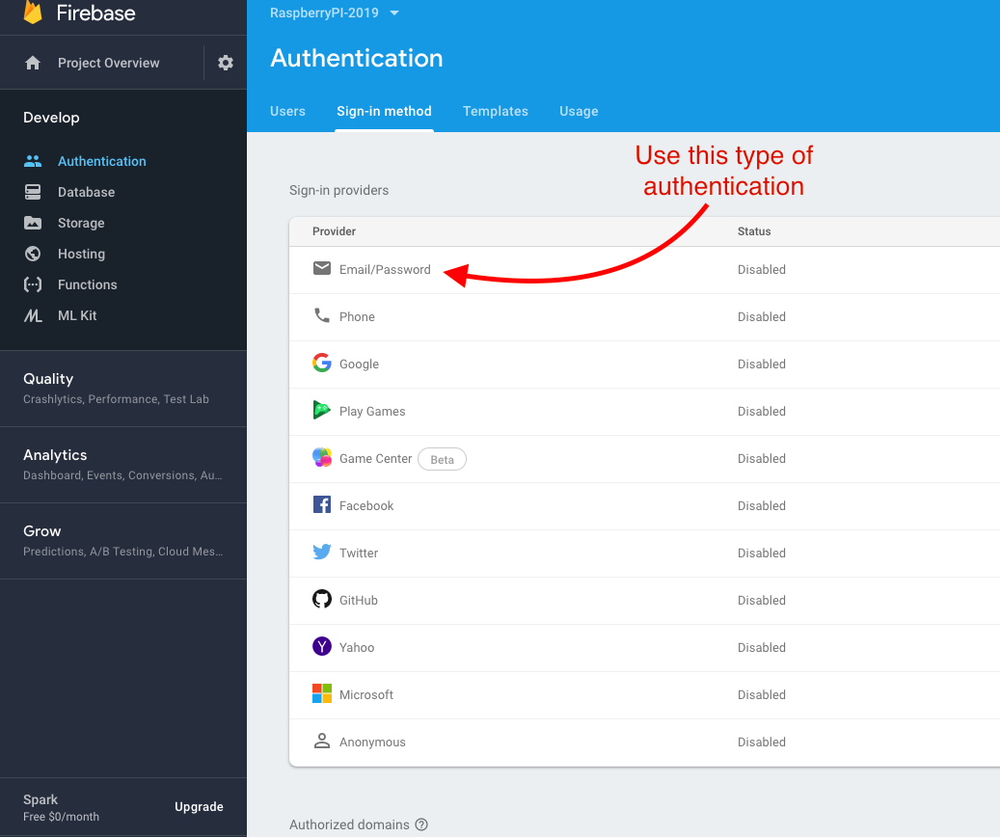
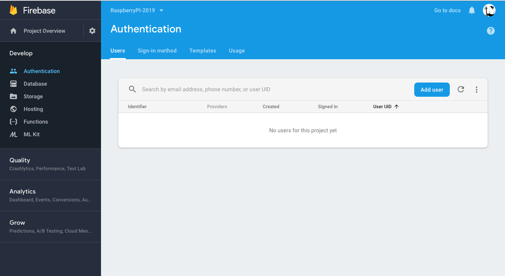
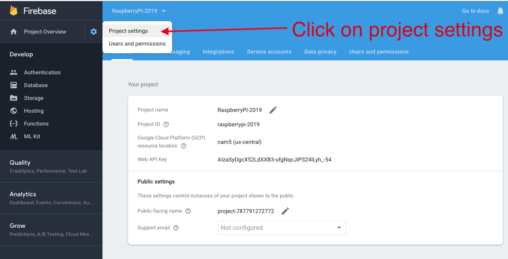
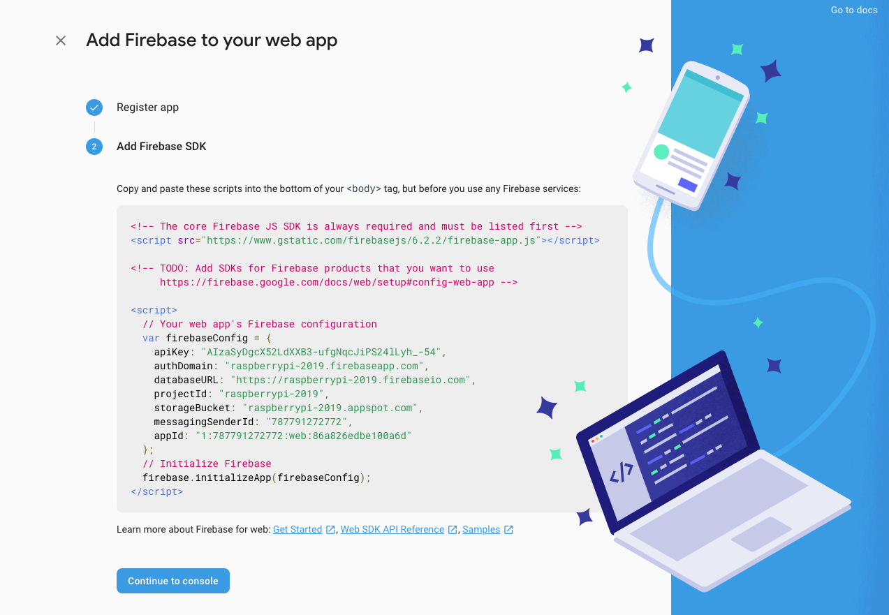
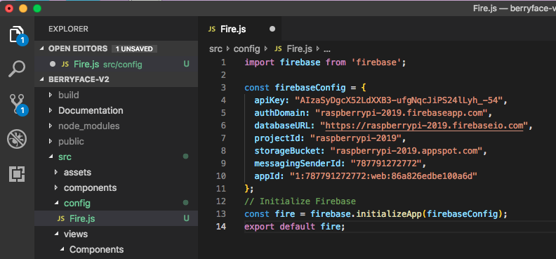

# Firebase Authentication

1. [ How Firebase Authentication Works ](#how-firebase-authentication-works)
2. [ Initial Set-up in Firebase Console ](#intial-set-up-firebase-console)
3. [ Adding firebase to your React App ](#adding-firebase-to-your-react-app)
4. [ Adding Auth to See Profile Page ](#adding-auth-to-see-profile-page)


<a name="how-firebase-authentication-works"></a>

### **_How Firebase Authentication Works_**

Log in to your Firebase console to adjust the services that you would like Firebase to handle. We connect our front end to the backend services that Firebase provides with what is called "Firebase SDK". These are the steps for authentication:

1. Have a form in your front end.
2. Capture users credentials using that form.
3. You then send those credentials to Firebase with a method provided to you by the Firebase SDK.
4. Then on the Firebase server, firebase validates these credentials and it sends back an authentication token to the browser so then we can access data in the front end from this token such as the name or the email of the user that's just logged in or signed in.
5. When requests are made to the firebase server after login for the (for example to the fire store or to cloud functions), this token is sent along to validate that that user has access to the services that you have allowed for that user/type of user. The token will specify which priviledge that user has or doesn't have.

<a name="intial-set-up-firebase-console"></a>

### **_Initial Set-up in Firebase Console_**

1. Go to your firebase console, click on the Authentication tab and click on the "Set up sign-in method".

2. For this tutorial, we will focus on the "Email/Password" way of authentication users. Click "Email/Passwork" and enable this type of authentication with the enable toggle in the modal.



3. Once you have enabled users, the users Tab in Authentication will update. You can add a user from this area if needed.



4. Next you need to get a special authentication object for your app. Start by adding your web app to your firebase project.



5. Once you add your project to your web app, you will be provided with a firebase object that contains all the necessary credentials. 




<a name="adding-firebase-to-your-react-app"></a>

### **_Adding firebase to your React App_**

- Install the firebase module with `npm install --save firebase`
- Create a folder named `config` inside `src` that is on the same level as `components` and `assets`.
- Inside `config`, create a file and name it `fire.js`




<a name="adding-auth-to-see-profile-page"></a>

### **_Adding Auth to See Profile Page_**


- As an example, this tutorial shows the following:
  - A user should not be able to go to the profile page until they've signed in.
  - When the user logs out, they are redirected to the home screen.

Here are the steps to accomplish this:

1. You will need to import `fire` from your `config` folder in the component that will take care of conditional rendering.
2. Next, we need to create an Authentication Listener, which uses methods defined the firebase module. This function will be called whenever the authentication state changes. Place this function above any component that will take care of conditional rendering. This function will return a user object with a callback.
3. You will need to create a state for the component that is taking care of conditional rendering so you can save whether a user is signed in or not.
4. Call your authentication listener during `componentDidMount()`

```jsx

```


https://www.youtube.com/watch?v=r4EsP6rovwk at 11:25