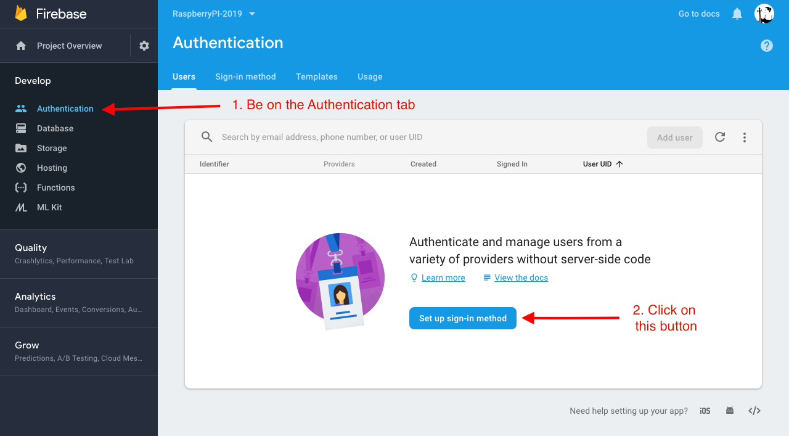
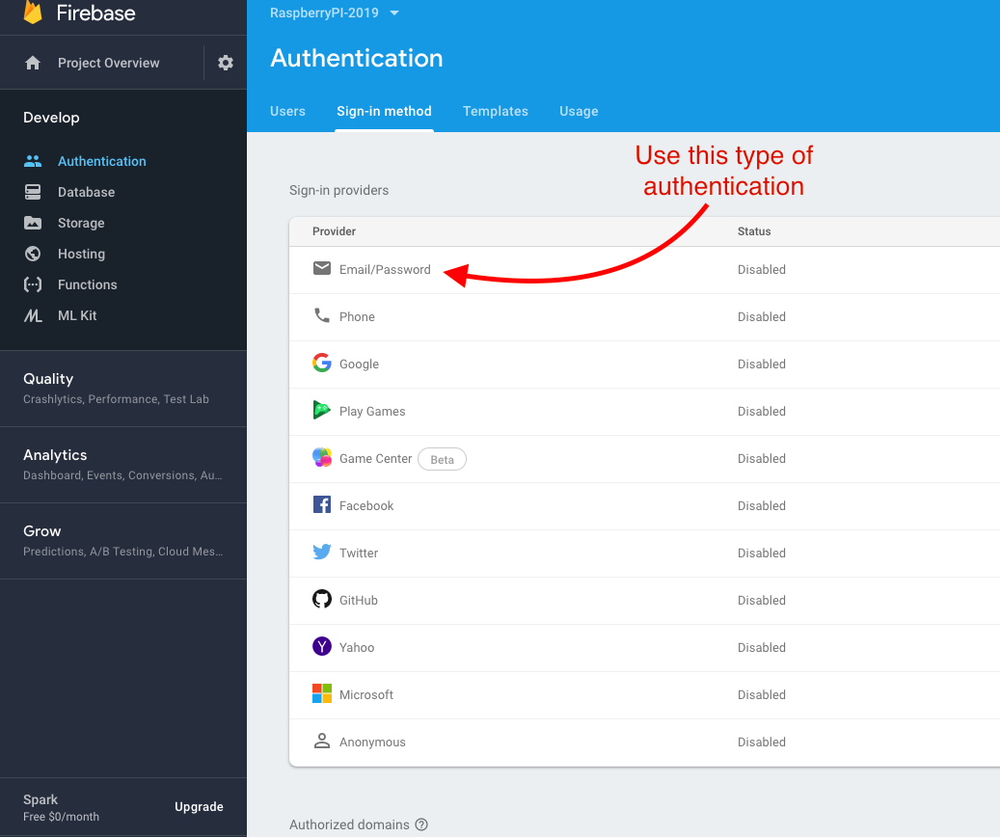
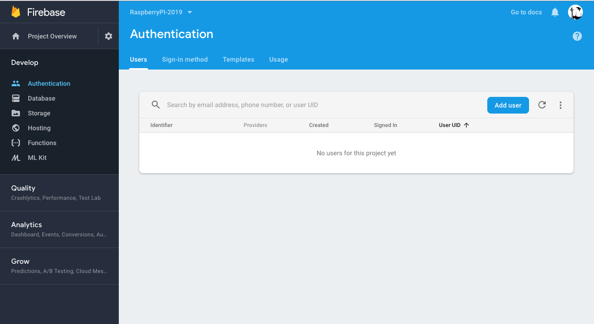

# Firebase Authentication

1. [ How Firebase Authentication Works ](#how-firebase-authentication-works)
2. [ Initial Set-up in Firebase Console ](#intial-set-up-firebase-console)

### **_How Firebase Authentication Works_**

Log in to your Firebase console to adjust the services that you would like Firebase to handle. We connect our front end to the backend services that Firebase provides with what is called "Firebase SDK". These are the steps for authentication:

1. Have a form in your front end.
2. Capture users credentials using that form.
3. You then send those credentials to Firebase with a method provided to you by the Firebase SDK.
4. Then on the Firebase server, firebase validates these credentials and it sends back an authentication token to the browser so then we can access data in the front end from this token such as the name or the email of the user that's just logged in or signed in.
5. When requests are made to the firebase server after login for the (for example to the fire store or to cloud functions), this token is sent along to validate that that user has access to the services that you have allowed for that user/type of user. The token will specify which priviledge that user has or doesn't have.

### **_Initial Set-up in Firebase Console_**

1. Go to your firebase console, click on the Authentication tab and click on the "Set up sign-in method".

2. For this tutorial, we will focus on the "Email/Password" way of authentication users. Click "Email/Passwork" and enable this type of authentication with the enable toggle in the modal.

3. Once you have enabled users, the users Tab in Authentication will update. You can add a user from this area if needed.

