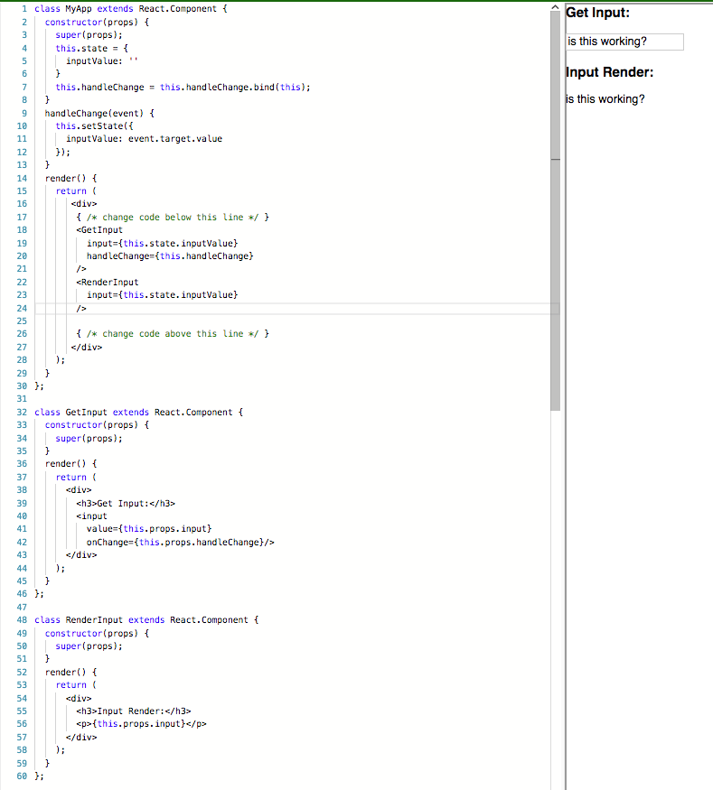
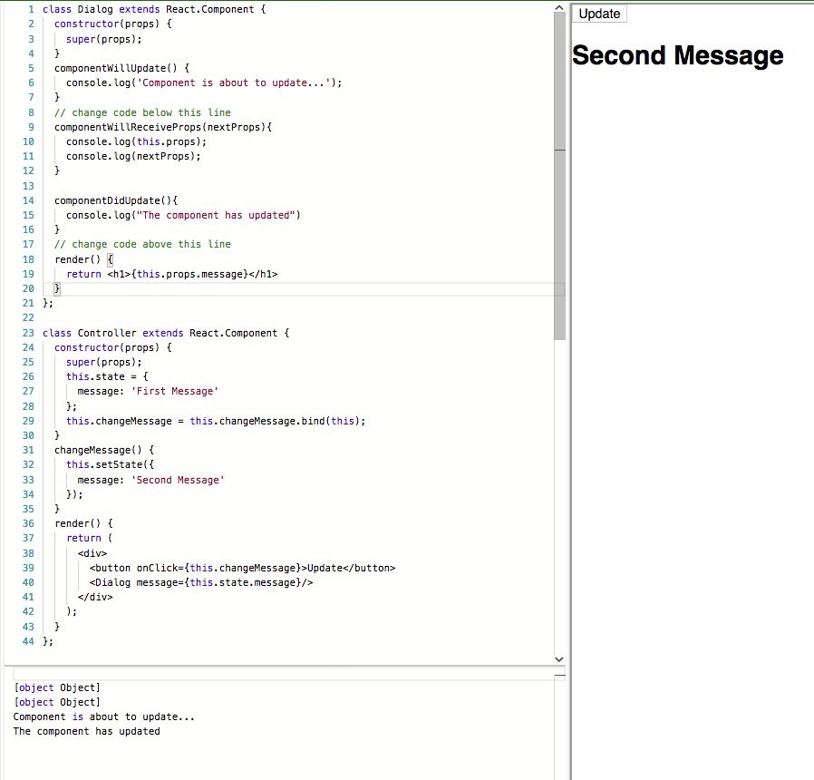

# React

## Free Code Camp Front End Libraries - React

1. [ JSX Elements ](#jsx-elements)
2. [ Comments ](#comments)
3. [ ReactDOM.render ](#reactdom.render)
4. [ Stateless Functional Component ](#stateless-functional-component)
5. [ Class Based Component ](#class-based-component)
6. [ Nesting Component ](#nesting-component)
7. [ Render Class Component to the DOM ](#render-class-component-to-the-dom)
8. [ Props in Stateless Functional Components ](#props-in-stateless-functional-components)
9. [ Pass an Array as Props ](#pass-an-array-as-props)
10. [ Default Props ](#default-props)
11. [ Props Types ](#prop-types)
12. [ Accessing Props in Class Component ](#accessing-props-in-class-component)
13. [ Stateful Components ](#stateful-components)
14. [ Set State with this.setState ](#set-state-with-this.setState)
15. [ Binding Custom Methods ](#binding-custom-methods)
16. [ Use State to Toggle ](#use-state-to-toggle)
17. [ Counter Exercise ](#counter-exercise)
18. [ Controlled Inputs ](#controlled-inputs)
19. [ Controlled Forms ](#controlled-forms)
20. [ Pass State as Props to Child Components ](#pass-state-as-props-to-child-components)
21. [ Pass a Callback as Props ](#pass-a-callback-as-props)
22. [ Lifecycle Methods ](#lifecycle-methods)
23. [ React Event Listeners ](#react-event-listeners)
24. [ Managing Updates with Lifecycle Methods ](#managing-updates-with-lifecycle-methods)
25. [ Optimize Re-Renders with shouldComponentUpdate ](#optimize-updates-with-shouldcomponentupdate)
26. [ Inline Style ](#inline-style)
27. [ Use Advanced JavaScript in React Render Method ](#use-advanced-javascript-in-react-render-method)
28. [ Magic Eight Ball Toy Exercise ](#magic-eight-ball-to-exercise)
29. [ Render with an If/Else Condition ](#render-with-an-if/else-condition)
30. [ Use && for a More Concise Conditional ](#use-&&-for-a-more-concise-conditonal)


<a name="jsx-elements"></a>

### **_JSX Elements_**

JavaScript called JSX that allows you to write HTML directly within JavaScript. You can always write JavaScript directly within JSX. To do this, you simply include the code you want to be treated as JavaScript within curly braces: `{ 'this is treated as JavaScript code' }`. Here is an example of a simple JSX element:

```jsx
const JSX = <h1>Hello JSX!</h1>;
```

A complex JSX element containe child elements. There must be one parent element that wraps all the other levels. Here is an example of valid JSX:

```jsx
const JSX = (
  <div>
    <h1>Header</h1>
    <p>Description</p>
    <ul>
      <li>First item</li>
      <li>Second item</li>
      <li>Third item</li>
    </ul>
  </div>
);
```

<a name="comments"></a>

### **_Comments_**

To put comments inside JSX, you use the syntax `{/* */}` to wrap around the comment text.

<a name="reactdom.render"></a>

### **_ReactDOM.render_**

With React, we can render JSX directly to the HTML DOM using React's rendering API known as ReactDOM. ReactDOM offers a simple method to render React elements to the DOM which looks like this: `ReactDOM.render(componentToRender, targetNode)`, where the first argument is the React element or component that you want to render, and the second argument is the DOM node that you want to render the component to.

As you would expect, `ReactDOM.render()` must be called after the JSX element declarations, just like how you must declare variables before using them.

**Exercise:**

Use the `ReactDOM.render()` method to render the component below. (You can pass defined JSX elements directly in as the first argument and use `document.getElementById()` to select the DOM node to render them to. There is a div with `id='challenge-node'` available).

Before:

```jsx
const JSX = (
  <div>
    <h1>Hello World</h1>
    <p>Lets render this to the DOM</p>
  </div>
);
```

After:

```jsx
const JSX = (
  <div>
    <h1>Hello World</h1>
    <p>Lets render this to the DOM</p>
  </div>
);
// change code below this line

ReactDOM.render(JSX, document.getElementById("challenge-node"));
```

<a name="stateless-functional-component"></a>

### **_Stateless Functional Component_**

There are two ways to create a React component. The first way is to use a JavaScript function. Defining a component in this way creates a stateless functional component. Think of a stateless component as one that can receive data and render it, but does not manage or track changes to that data.

To create a component with a function, you simply write a JavaScript function that returns either JSX or null. One important thing to note is that React requires your function name to begin with a capital letter. Here's an example of a stateless functional component that assigns an HTML class in JSX:

```jsx
// After being transpiled, the <div> will have a CSS class of 'customClass'
const DemoComponent = function() {
  return <div className="customClass" />;
};
```

And here is an example of a stateless functional component with ES6 syntax:

```jsx
const ChildComponent = () => {
  return (
    <div>
      <p>Random text</p>
    </div>
  );
};
```

<a name="class-based-component"></a>

### **_Class Based Component_**

The other way to define a React component is with the ES6 `class` syntax. In the following example, `Kitten` extends `React.Component`:

```jsx
class Kitten extends React.Component {
  constructor(props) {
    super(props);
  }

  render() {
    return <h1>Hi</h1>;
  }
}
```

The `Kitten` class has a `constructor` defined within it that calls `super()`. It uses `super()` to call the constructor of the parent class, in this case `React.Component`. The constructor is a special method used during the initialization of objects that are created with the `class` keyword. It is best practice to call a component's constructor with `super`, and pass `props` to both.

<a name="nesting-component"></a>

### **_Nesting Component_**

There are two functional components defined in the exaple below, called `TypesOfFruit` and `Fruits`. `TypesOfFruit` is nested it within the `Fruits` component. Then the `Fruits` component is nested in the `TypesOfFood` component.

```jsx
const TypesOfFruit = () => {
  return (
    <div>
      <h2>Fruits:</h2>
      <ul>
        <li>Apples</li>
        <li>Blueberries</li>
        <li>Strawberries</li>
        <li>Bananas</li>
      </ul>
    </div>
  );
};

const Fruits = () => {
  return (
    <div>
      <TypesOfFruit />
    </div>
  );
};

class TypesOfFood extends React.Component {
  constructor(props) {
    super(props);
  }

  render() {
    return (
      <div>
        <h1>Types of Food:</h1>
        <Fruits />
      </div>
    );
  }
}
```

You can render JSX elements, stateless functional components, and ES6 class components within other components.

<a name="render-class-component-to-the-dom"></a>

### **_Render Class Component to the DOM_**

React components are passed into ReactDOM.render() a little differently than JSX elements. For JSX elements, you pass in the name of the element that you want to render. However, for React components, you need to use the same syntax as if you were rendering a nested component, for example `ReactDOM.render(<ComponentToRender />, targetNode)`. You use this syntax for both ES6 class components and functional components.

<a name="props-in-stateless-functional-components"></a>

### **_Props in Stateless Functional Components_**

In React, you can pass props, or properties, to child components. Say you have an `App` component which renders a child component called `Welcome` that is a stateless functional component. You can pass `Welcome` a `user` property by writing:

```jsx
<App>
  <Welcome user="Mark" />
</App>
```

You use _custom HTML attributes_ that React provides support for to pass the property `user` to the component `Welcome`. Since `Welcome` is a stateless functional component, it has access to this value like so:

```jsx
const Welcome = props => <h1>Hello, {props.user}!</h1>;
```

It is standard to call this value props and when dealing with stateless functional components, you basically consider it as an argument to a function which returns JSX. You can access the value of the argument in the function body.

**Exercise**

There are `Calendar` and `CurrentDate` components in the code editor. When rendering `CurrentDate` from the `Calendar` component, pass in a property of `date` assigned to the current date from JavaScript's `Date object`. Then access this prop in the `CurrentDate` component, showing its value within the `p` tags. Note that for `prop` values to be evaluated as JavaScript, they must be enclosed in curly brackets, for instance `date={Date()}`.

_Before:_

```jsx
const CurrentDate = props => {
  return (
    <div>
      {/* change code below this line */}
      <p>The current date is: </p>
      {/* change code above this line */}
    </div>
  );
};

class Calendar extends React.Component {
  constructor(props) {
    super(props);
  }
  render() {
    return (
      <div>
        <h3>What date is it?</h3>
        {/* change code below this line */}
        <CurrentDate />
        {/* change code above this line */}
      </div>
    );
  }
}
```

_After:_

```jsx
const CurrentDate = props => {
  return (
    <div>
      {/* change code below this line */}
      <p>The current date is: {props.date} </p>
      {/* change code above this line */}
    </div>
  );
};

class Calendar extends React.Component {
  constructor(props) {
    super(props);
  }
  render() {
    return (
      <div>
        <h3>What date is it?</h3>
        {/* change code below this line */}
        <CurrentDate date={Date()} />
        {/* change code above this line */}
      </div>
    );
  }
}
```

<a name="pass-an-array-as-props"></a>

### **_Pass an Array as Props_**

To pass an array to a JSX element, it must be treated as JavaScript and wrapped in curly braces.

```jsx
<ParentComponent>
  <ChildComponent colors={["green", "blue", "red"]} />
</ParentComponent>
```

The child component then has access to the array property `colors`. Array methods such as `join()` can be used when accessing the property.

```jsx
const ChildComponent = props => <p>{props.colors.join(", ")}</p>;
```

This will join all `colors` array items into a comma separated string and produce:

```html
<p>green, blue, red</p>
```

**Exercise:**

There are `List` and `ToDo` components in the code editor. When rendering each `List` from the `ToDo` component, pass in a `tasks` property assigned to an array of to-do tasks, for example `["walk dog", "workout"]`. Then access this tasks array in the `List` component, showing its value within the `p` element. Use `join(", ")` to display the `props.tasksarray` in the `p` element as a comma separated list. Today's list should have at least 2 tasks and tomorrow's should have at least 3 tasks.

_Before:_

```jsx
const List = props => {
  {
    /* change code below this line */
  }
  return <p>{}</p>;
  {
    /* change code above this line */
  }
};

class ToDo extends React.Component {
  constructor(props) {
    super(props);
  }
  render() {
    return (
      <div>
        <h1>To Do Lists</h1>
        <h2>Today</h2>
        {/* change code below this line */}
        <List />
        <h2>Tomorrow</h2>
        <List />
        {/* change code above this line */}
      </div>
    );
  }
}
```

_After:_

```jsx
const List = props => {
  {
    /* change code below this line */
  }
  return <p>{props.tasks.join(", ")}</p>;
  {
    /* change code above this line */
  }
};

class ToDo extends React.Component {
  constructor(props) {
    super(props);
  }
  render() {
    return (
      <div>
        <h1>To Do Lists</h1>
        <h2>Today</h2>
        {/* change code below this line */}
        <List tasks={["walk dog", "workout"]} />
        <h2>Tomorrow</h2>
        <List tasks={["walk dog", "workout", "swim"]} />
        {/* change code above this line */}
      </div>
    );
  }
}
```

<a name="default-props"></a>

### **_Default Props_**

You can assign default props to a component as a property on the component itself and React assigns the default prop if necessary. This allows you to specify what a prop value should be if no value is explicitly provided.

For example, if you declare `MyComponent.defaultProps = { location: 'San Francisco' }`, you have defined a location prop that's set to the string `San Francisco`, unless you specify otherwise. React assigns default props if props are undefined, but if you pass `null` as the value for a prop, it will remain `null`.

**Exercise:**

The code editor shows a `ShoppingCart` component. Define default props on this component which specify a prop items with a value of `0`.

_Before:_

```jsx
const ShoppingCart = props => {
  return (
    <div>
      <h1>Shopping Cart Component</h1>
    </div>
  );
};
// change code below this line
```

_After:_

```jsx
const ShoppingCart = props => {
  return (
    <div>
      <h1>Shopping Cart Component</h1>
    </div>
  );
};
// change code below this line

ShoppingCart.defaultProps = { items: 0 };
```

The ability to set default props is a useful feature in React. The way to override the default props is to explicitly set the prop values for a component.

**Exercise:**

The `ShoppingCart` component now renders a child component `Items`. This `Items` component has a default prop `quantity` set to the integer `0`. Override the default prop by passing in a value of `10` for `quantity`.

(Since the value for `quantity` is an integer, it won't go in quotes but it should be wrapped in curly braces. For example, `{100}`. This syntax tells JSX to interpret the value within the braces directly as JavaScript.)

_Before:_

```jsx
const Items = props => {
  return <h1>Current Quantity of Items in Cart: {props.quantity}</h1>;
};

Items.defaultProps = {
  quantity: 0
};

class ShoppingCart extends React.Component {
  constructor(props) {
    super(props);
  }
  render() {
    {
      /* change code below this line */
    }
    return <Items />;
    {
      /* change code above this line */
    }
  }
}
```

_After:_

```jsx
const Items = props => {
  return <h1>Current Quantity of Items in Cart: {props.quantity}</h1>;
};

Items.defaultProps = {
  quantity: 0
};

class ShoppingCart extends React.Component {
  constructor(props) {
    super(props);
  }
  render() {
    {
      /* change code below this line */
    }
    return <Items quantity={10} />;
    {
      /* change code above this line */
    }
  }
}
```

<a name="prop-types"></a>

### **_Prop Types_**

React provides useful type-checking features to verify that components receive props of the correct type. Setting prop types will throw a useful warning when the data passed is of any other type. You can define a `propTypes` property for a component in the same way you defined `defaultProps`. Here's an example to require the type `function` for a prop called `handleClick`:

```jsx
MyComponent.propTypes = { handleClick: PropTypes.func.isRequired };
```

Notice that `func` represents `function`. Among the seven JavaScript primitive types, `function` and `boolean` (written as `bool`) are the only two that use unusual spelling. As of React v15.5.0, `PropTypes` is imported independently from React, like this:

```jsx
import React, { PropTypes } from "react";
```

<a name="accessing-props-in-class-component"></a>

### **_Accessing Props in Class Component_**

Anytime you refer to a class component within itself, you use the `this` keyword. To access props within a class component, you preface the code that you use to access it with `this`. For example, if an ES6 class component has a prop called `data`, you write `{this.props.data}` in JSX.

**Exercise:**

Render an instance of the `ReturnTempPassword` component in the parent component `ResetPassword`. Here, give `ReturnTempPassword` a prop of `tempPassword` and assign it a value of a string that is at least 8 characters long. Within the child, `ReturnTempPassword`, access the `tempPassword` prop within the strong tags to make sure the user sees the temporary password.

_Before:_

```jsx
class ReturnTempPassword extends React.Component {
  constructor(props) {
    super(props);
  }
  render() {
    return (
      <div>
        {/* change code below this line */}
        <p>
          Your temporary password is: <strong />
        </p>
        {/* change code above this line */}
      </div>
    );
  }
}

class ResetPassword extends React.Component {
  constructor(props) {
    super(props);
  }
  render() {
    return (
      <div>
        <h2>Reset Password</h2>
        <h3>We've generated a new temporary password for you.</h3>
        <h3>Please reset this password from your account settings ASAP.</h3>
        {/* change code below this line */}

        {/* change code above this line */}
      </div>
    );
  }
}
```

_After:_

```jsx
class ReturnTempPassword extends React.Component {
  constructor(props) {
    super(props);
  }
  render() {
    return (
      <div>
        {/* change code below this line */}
        <p>
          Your temporary password is: <strong>{this.props.tempPassword}</strong>
        </p>
        {/* change code above this line */}
      </div>
    );
  }
}

class ResetPassword extends React.Component {
  constructor(props) {
    super(props);
  }
  render() {
    return (
      <div>
        <h2>Reset Password</h2>
        <h3>We've generated a new temporary password for you.</h3>
        <h3>Please reset this password from your account settings ASAP.</h3>
        {/* change code below this line */}
        <ReturnTempPassword tempPassword={"password"} />
        {/* change code above this line */}
      </div>
    );
  }
}
```

<a name="stateful-components"></a>

### **_Stateful Components_**

State consists of any data your application needs to know about, that can change over time. You want your apps to respond to state changes and present an updated UI when necessary.

You create state in a React component by declaring a `state` property in the component class in its constructor. This initializes the component with `state` when it is created. The `state` property must be set to a JavaScript `object`. Declaring it looks like this:

```jsx
this.state = {
  // describe your state here
};
```

You have access to the `state` object throughout the life of your component. You can update it, render it in your UI, and pass it as `props` to child components. The `state` object can be as complex or as simple as you need it to be. Note that you must create a class component by extending React.Component in order to create `state`.

**Exercise:**

There is a component in the code editor that is trying to render a `name` property from its `state`. However, there is no state `defined`. Initialize the component with `state` in the `constructor` and assign your name to a property of `name`..

_Before:_

```jsx
class StatefulComponent extends React.Component {
  constructor(props) {
    super(props);
    // initialize state here
  }
  render() {
    return (
      <div>
        <h1>{this.state.name}</h1>
      </div>
    );
  }
}
```

_After:_

```jsx
class StatefulComponent extends React.Component {
  constructor(props) {
    super(props);
    // initialize state here
    this.state = {
      name: "Liz"
    };
  }
  render() {
    return (
      <div>
        <h1>{this.state.name}</h1>
      </div>
    );
  }
}
```

Once you define a component's initial state, you can display any part of it in the UI that is rendered. If a component is stateful, it will always have access to the data in `state` in its `render()` method. You can access the data with `this.state`. If you want to access a state value within the return of the render method, you have to enclose the value in curly braces. Note that if you make a component stateful, no other components are aware of its `state`. Its `state` is completely encapsulated, or local to that component, unless you pass state data to a child component as props.

**Exercise:**

`MyComponent` below is stateful. Define an `h1` tag in the component's render method which renders the value of `name` from the component's state.

_Before:_

```jsx
class MyComponent extends React.Component {
  constructor(props) {
    super(props);
    this.state = {
      name: "freeCodeCamp"
    };
  }
  render() {
    return (
      <div>
        {/* change code below this line */}

        {/* change code above this line */}
      </div>
    );
  }
}
```

_After:_

```jsx
class MyComponent extends React.Component {
  constructor(props) {
    super(props);
    this.state = {
      name: "freeCodeCamp"
    };
  }
  render() {
    return (
      <div>
        {/* change code below this line */}
        <h1>{this.state.name}</h1>
        {/* change code above this line */}
      </div>
    );
  }
}
```

There is another way to access `state` in a component. In the `render()` method, before the `return` statement, you can write JavaScript directly. For example, you could declare functions, access data from `state` or `props`, perform computations on this data, and so on. Then, you can assign any data to variables, which you have access to in the `return` statement.

**Exercise:**

In the `MyComponent` render method, define a `const` called `name` and set it equal to the `name`value in the component's `state`. Next, in the `return` statement, render this value in an `h1` tag using the variable name.

_Before:_

```jsx
class MyComponent extends React.Component {
  constructor(props) {
    super(props);
    this.state = {
      name: "freeCodeCamp"
    };
  }
  render() {
    // change code below this line

    // change code above this line
    return (
      <div>
        {/* change code below this line */}

        {/* change code above this line */}
      </div>
    );
  }
}
```

_After:_

```jsx
class MyComponent extends React.Component {
  constructor(props) {
    super(props);
    this.state = {
      name: "freeCodeCamp"
    };
  }
  render() {
    // change code below this line
    const name = this.state.name;
    // change code above this line
    return (
      <div>
        {/* change code below this line */}
        <h1>{name}</h1>
        {/* change code above this line */}
      </div>
    );
  }
}
```

<a name="set-state-with-this.setState"></a>

### **_Set State with this.setState_**

React provides a method for updating component state called `setState`. You call the `setState` method within your component class like so: `this.setState()`, passing in an object with key-value pairs. The keys are your state properties and the values are the updated state data. For instance, if we were storing a username in state and wanted to update it, it would look like this:

```jsx
this.setState({
  username: "Lewis"
});
```

React expects you to never modify `state` directly, instead always use `this.setState()` when state changes occur.

**Exercise:**

There is a `button` element which has an `onClick()` handler. This handler is triggered when the button receives a click event in the browser, and runs the `handleClick` method defined in `MyComponent`. Within the `handleClick` method, update the component state using `this.setState()`. Set the `name` property in `state` to equal the string `React Rocks!`.

_Before:_

```jsx
class MyComponent extends React.Component {
  constructor(props) {
    super(props);
    this.state = {
      name: "Initial State"
    };
    this.handleClick = this.handleClick.bind(this);
  }
  handleClick() {
    // change code below this line
    // change code above this line
  }
  render() {
    return (
      <div>
        <button onClick={this.handleClick}>Click Me</button>
        <h1>{this.state.name}</h1>
      </div>
    );
  }
}
```

_After:_

```jsx
class MyComponent extends React.Component {
  constructor(props) {
    super(props);
    this.state = {
      name: "Initial State"
    };
    this.handleClick = this.handleClick.bind(this);
  }
  handleClick() {
    // change code below this line
    this.setState({
      name: "React Rocks!"
    });
    // change code above this line
  }
  render() {
    return (
      <div>
        <button onClick={this.handleClick}>Click Me</button>
        <h1>{this.state.name}</h1>
      </div>
    );
  }
}
```

<a name="binding-custom-methods"></a>

### **_Binding Custom Methods_**

You can define methods for your class components. A class method typically needs to use the `this` keyword so it can access class `properties` and its `state`. One common way is to explicitly bind `this` in the `constructor` so `this` becomes bound to the class methods when the component is initialized.

You may have noticed the last challenge used `this.handleClick = this.handleClick.bind(this)` for its `handleClick` method in the constructor. Then, when you call a function like `this.setState()` within your class method, `this` refers to the class and will not be undefined.

**Exercise:**

Below there is a component with a `state` that keeps track of an item count. It also has a method which allows you to increment this item count. However, the method doesn't work because it's using the `this` keyword that is undefined. Fix it by explicitly binding `this` to the `addItem()` method in the component's constructor. Next, add a click handler to the button element in the `render` method. It should trigger the `addItem()` method when the button receives a click event.

_Before:_

```jsx
class MyComponent extends React.Component {
  constructor(props) {
    super(props);
    this.state = {
      itemCount: 0
    };
    // change code below this line

    // change code above this line
  }
  addItem() {
    this.setState({
      itemCount: this.state.itemCount + 1
    });
  }
  render() {
    return (
      <div>
        {/* change code below this line */}
        <button>Click Me</button>
        {/* change code above this line */}
        <h1>Current Item Count: {this.state.itemCount}</h1>
      </div>
    );
  }
}
```

_After:_

```jsx
class MyComponent extends React.Component {
  constructor(props) {
    super(props);
    this.state = {
      itemCount: 0
    };
    // change code below this line
    this.addItem = this.addItem.bind(this);
    // change code above this line
  }
  addItem() {
    this.setState({
      itemCount: this.state.itemCount + 1
    });
  }
  render() {
    return (
      <div>
        {/* change code below this line */}
        <button onClick={this.addItem}>Click Me</button>
        {/* change code above this line */}
        <h1>Current Item Count: {this.state.itemCount}</h1>
      </div>
    );
  }
}
```

<a name="use-state-to-toggle"></a>

### **_Use State to Toggle_**

**Exercise:**

`MyComponent` has a `visibility` property which is initialized to `false`. The `render` method returns one view if the value of visibility is `true`, and a different view if it is `false`.

The value of `visibility` should toggle back and forth between `true` and `false`. There is a click handler on the button which triggers a class method called `toggleVisibility()`. Define this method so the state of visibility toggles to the opposite value when the method is called.

_Before:_

```jsx
class MyComponent extends React.Component {
  constructor(props) {
    super(props);
    this.state = {
      visibility: false
    };
    // change code below this line

    // change code above this line
  }
  // change code below this line

  // change code above this line
  render() {
    if (this.state.visibility) {
      return (
        <div>
          <button onClick={this.toggleVisibility}>Click Me</button>
          <h1>Now you see me!</h1>
        </div>
      );
    } else {
      return (
        <div>
          <button onClick={this.toggleVisibility}>Click Me</button>
        </div>
      );
    }
  }
}
```

_After:_

```jsx
class MyComponent extends React.Component {
  constructor(props) {
    super(props);
    this.state = {
      visibility: false
    };
    // change code below this line
    this.toggleVisibility = this.toggleVisibility.bind(this);
    // change code above this line
  }
  // change code below this line

  toggleVisibility() {
    this.setState({
      visibility: !this.state.visibility
    });
  }

  // change code above this line
  render() {
    if (this.state.visibility) {
      return (
        <div>
          <button onClick={this.toggleVisibility}>Click Me</button>
          <h1>Now you see me!</h1>
        </div>
      );
    } else {
      return (
        <div>
          <button onClick={this.toggleVisibility}>Click Me</button>
        </div>
      );
    }
  }
}
```

<a name="counter-exercise"></a>

### **_Counter Exercise_**

**Exercise:**

The `Counter` component keeps track of a `count` value in `state`. There are two buttons which call methods `increment()` and `decrement()`. Write these methods so the counter value is incremented or decremented by 1 when the appropriate button is clicked. Also, create a `reset()` method so when the reset button is clicked, the count is set to 0.

_Before:_

```jsx
class Counter extends React.Component {
  constructor(props) {
    super(props);
    this.state = {
      count: 0
    };
    // change code below this line

    // change code above this line
  }
  // change code below this line

  // change code above this line
  render() {
    return (
      <div>
        <button className='inc' onClick={this.increment}>Increment!</button>
        <button className='dec' onClick={this.decrement}>Decrement!</button>
        <button className='reset' onClick={this.reset}>Reset</button>
        <h1>Current Count: {this.state.count}</h1>
      </div>
    );
```

_After:_

```jsx
class Counter extends React.Component {
  constructor(props) {
    super(props);
    this.state = {
      count: 0
    };
    // change code below this line
    this.increment = this.increment.bind(this);
    this.decrement = this.decrement.bind(this);
    this.reset = this.reset.bind(this);
    // change code above this line
  }
  // change code below this line

  increment() {
    this.setState({
      count: this.state.count + 1
    });
  }

  decrement() {
    this.setState({
      count: this.state.count - 1
    });
  }

  reset() {
    this.setState({
      count: (this.state.count = 0)
    });
  }

  // change code above this line
  render() {
    return (
      <div>
        <button className="inc" onClick={this.increment}>
          Increment!
        </button>
        <button className="dec" onClick={this.decrement}>
          Decrement!
        </button>
        <button className="reset" onClick={this.reset}>
          Reset
        </button>
        <h1>Current Count: {this.state.count}</h1>
      </div>
    );
  }
}
```

<a name="controlled-inputs"></a>

### **_Controlled Inputs_**

In React,most form inputs maintain their own `state` in the DOM as the user types. An example of _Form Control Elements_ for text input, are `input` and `textarea`. With React, you can move this mutable state into a React component's `state`.

**Exercise:**

First, create a method called `handleChange()` that has a parameter called `event`. When the method is called, it receives an event object that contains a string of text from the `input` element. You can access this string with `event.target.value` inside the method. Update the input property of the component's `state` with this new string.

_Before:_

```jsx
class ControlledInput extends React.Component {
  constructor(props) {
    super(props);
    this.state = {
      input: ''
    };
    // change code below this line

    // change code above this line
  }
  // change code below this line

  // change code above this line
  render() {
    return (
      <div>
        { /* change code below this line */}

        { /* change code above this line */}
        <h4>Controlled Input:</h4>
        <p>{this.state.input}</p>
      </div>
    );
  }
};
```

_After:_

```jsx
class ControlledInput extends React.Component {
  constructor(props) {
    super(props);
    this.state = {
      input: ''
    };
    // change code below this line
    this.handleChange = this.handleChange.bind(this);
    // change code above this line
  }
  // change code below this line
  handleChange(event){
    this.setState({
      input: event.target.value
    })
  }
  // change code above this line
  render() {
    return (
      <div>
        { /* change code below this line */}
        <input value = {this.state.input} onChange={this.handleChange} />
        { /* change code above this line */}
        <h4>Controlled Input:</h4>
        <p>{this.state.input}</p>
      </div>
    );
  }
};
```

<a name="controlled-forms"></a>

### **_Controlled Forms_**

The last challenge showed that React can control the internal state for certain elements like `input` and `textarea`, which makes them controlled components. This applies to other form elements as well, including the regular HTML `form` element.

**Exercise:**

The `MyForm` component is set up with an empty form with a submit handler. Add an `input` element in the form and set its value and `onChange()` attributes. Then complete the `handleSubmit` method so that it sets the component state property `submit` to the current input value in the local `state`. (You also must call event.preventDefault() in the submit handler, to prevent the default form submit behavior which will refresh the web page.) Finally, create an `h1` tag after the `form` which renders the submit value from the component's `state`. You can then type in the form and click the button (or press enter), and you should see your input rendered to the page.

_Before:_

```jsx
class MyForm extends React.Component {
  constructor(props) {
    super(props);
    this.state = {
      input: '',
      submit: ''
    };
    this.handleChange = this.handleChange.bind(this);
    this.handleSubmit = this.handleSubmit.bind(this);
  }
  handleChange(event) {
    this.setState({
      input: event.target.value
    });
  }
  handleSubmit(event) {
    // change code below this line

    // change code above this line
  }
  render() {
    return (
      <div>
        <form onSubmit={this.handleSubmit}>
          { /* change code below this line */ }

          { /* change code above this line */ }
          <button type='submit'>Submit!</button>
        </form>
        { /* change code below this line */ }

        { /* change code above this line */ }
      </div>
    );
  }
};
```

_After:_

```jsx
class MyForm extends React.Component {
  constructor(props) {
    super(props);
    this.state = {
      input: '',
      submit: ''
    };
    this.handleChange = this.handleChange.bind(this);
    this.handleSubmit = this.handleSubmit.bind(this);
  }
  handleChange(event) {
    this.setState({
      input: event.target.value
    });
  }
  handleSubmit(event) {
    // change code below this line
    event.preventDefault();
    this.setState({
      submit: this.state.input
    })
    // change code above this line
  }
  render() {
    return (
      <div>
        <form onSubmit={this.handleSubmit}>
          { /* change code below this line */ }
          <input value = {this.state.input} onChange={this.handleChange} />
          { /* change code above this line */ }
          <button type='submit'>Submit!</button>
        </form>
        { /* change code below this line */ }
        <h1>{this.state.submit}</h1>
        { /* change code above this line */ }
      </div>
    );
  }
};
```

<a name="pass-state-as-props-to-child-components"></a>

### **_Pass State as Props to Child Components_**

A common pattern is to have a stateful component containing the `state` important to your app, that then renders child components. You want these components to have access to some pieces of that `state`, which are passed in as `props`.

For example, maybe you have an `App` component that renders a `Navbar`, among other components. In your `App`, you have state that contains a lot of user information, but the `Navbar` only needs access to the user's username so it can display it. You pass that piece of `state` to the `Navbar` component as a prop.

This pattern illustrates some important paradigms in React. The first is _unidirectional data flow_. State flows in one direction down the tree of your application's components, from the stateful parent component to child components. The child components only receive the state data they need. The second is that complex stateful apps can be broken down into just a few, or maybe a single, stateful component. The rest of your components simply receive state from the parent as props, and render a UI from that state. It begins to create a separation where state management is handled in one part of code and UI rendering in another. This principle of separating state logic from UI logic is one of React's key principles. When it's used correctly, it makes the design of complex, stateful applications much easier to manage.

**Exercise:**

The `MyApp` component is stateful and renders a `Navbar` component as a child. Pass the `name` property in its `state` down to the child component, then show the `name` in the `h1` tag that's part of the Navbar render method.

_Before:_

```jsx
class MyApp extends React.Component {
  constructor(props) {
    super(props);
    this.state = {
      name: 'CamperBot'
    }
  }
  render() {
    return (
       <div>
         <Navbar /* your code here */ />
       </div>
    );
  }
};

class Navbar extends React.Component {
  constructor(props) {
    super(props);
  }
  render() {
    return (
    <div>
      <h1>Hello, my name is: /* your code here */ </h1>
    </div>
    );
  }
};
```

_After:_

```jsx
class MyApp extends React.Component {
  constructor(props) {
    super(props);
    this.state = {
      name: 'CamperBot'
    }
  }
  render() {
    return (
       <div>
         <Navbar name={this.state.name} />
       </div>
    );
  }
};

class Navbar extends React.Component {
  constructor(props) {
    super(props);
  }
  render() {
    return (
    <div>
      <h1>Hello, my name is: {this.props.name} </h1>
    </div>
    );
  }
};
```

<a name="pass-a-callback-as-props"></a>

### **_Pass a Callback as Props_**

You can pass `state` as props to child components, but you're not limited to passing data. You can also pass handler functions or any method that's defined on a React component to a child component. This is how you allow child components to interact with their parent components. You pass methods to a child just like a regular prop. It's assigned a name and you have access to that method name under `this.props` in the child component.

**Exercise:**

The `MyApp` component is the parent that will render the `GetInput` and `RenderInput` child components. Add the `GetInput` component to the render method in `MyApp`, then pass it a prop called `input` assigned to `inputValue` from `MyApp`'s `state`. Also create a prop called `handleChange` and pass the input handler `handleChange` to it.

Next, add `RenderInput` to the render method in `MyApp`, then create a prop called `input` and pass the `inputValue` from state to it. Once you are finished you will be able to type in the input field in the `GetInput` component, which then calls the handler method in its parent via props. This updates the input in the state of the parent, which is passed as props to both children. (Observe how the data flows between the components and how the single source of truth remains the state of the parent component.)


_Before:_

```jsx
class MyApp extends React.Component {
  constructor(props) {
    super(props);
    this.state = {
      inputValue: ''
    }
    this.handleChange = this.handleChange.bind(this);
  }
  handleChange(event) {
    this.setState({
      inputValue: event.target.value
    });
  }
  render() {
    return (
       <div>
        { /* change code below this line */ }

        { /* change code above this line */ }
       </div>
    );
  }
};

class GetInput extends React.Component {
  constructor(props) {
    super(props);
  }
  render() {
    return (
      <div>
        <h3>Get Input:</h3>
        <input
          value={this.props.input}
          onChange={this.props.handleChange}/>
      </div>
    );
  }
};

class RenderInput extends React.Component {
  constructor(props) {
    super(props);
  }
  render() {
    return (
      <div>
        <h3>Input Render:</h3>
        <p>{this.props.input}</p>
      </div>
    );
  }
};
```

_After:_

```jsx
class MyApp extends React.Component {
  constructor(props) {
    super(props);
    this.state = {
      inputValue: ''
    }
    this.handleChange = this.handleChange.bind(this);
  }
  handleChange(event) {
    this.setState({
      inputValue: event.target.value
    });
  }
  render() {
    return (
       <div>
        { /* change code below this line */ }
        <GetInput 
          input={this.state.inputValue} 
          handleChange={this.handleChange}
        />
        <RenderInput 
          input={this.state.inputValue}
        />

        { /* change code above this line */ }
       </div>
    );
  }
};

class GetInput extends React.Component {
  constructor(props) {
    super(props);
  }
  render() {
    return (
      <div>
        <h3>Get Input:</h3>
        <input
          value={this.props.input}
          onChange={this.props.handleChange}/>
      </div>
    );
  }
};

class RenderInput extends React.Component {
  constructor(props) {
    super(props);
  }
  render() {
    return (
      <div>
        <h3>Input Render:</h3>
        <p>{this.props.input}</p>
      </div>
    );
  }
};
```

Admittedly, this example is a bit contrived, but should serve to illustrate how data and callbacks can be passed between React components.




<a name="lifecycle-methods"></a>

### **_Lifecycle Methods_**

React components have several special methods that provide opportunities to perform actions at specific points in the lifecycle of a component. These are called lifecycle methods, or lifecycle hooks, and allow you to catch components at certain points in time. Here is a list of some of the main lifecycle methods:

```jsx
componentWillMount()

componentDidMount()

componentWillReceiveProps()

shouldComponentUpdate()

componentWillUpdate()

componentDidUpdate()

componentWillUnmount()
```


<a name="react-event-listeners"></a>

### **_React Event Listeners_**

The `componentDidMount()` method is also the best place to attach any event listeners you need to add for specific functionality. React provides a synthetic event system which wraps the native event system present in browsers. This means that the synthetic event system behaves exactly the same regardless of the user's browser - even if the native events may behave differently between different browsers. React's synthetic event system is great to use for most interactions you'll manage on DOM elements. However, if you want to attach an event handler to the document or window objects, you have to do this directly.

**Exercise:**

Attach an event listener in the `componentDidMount()` method for keydown events and have these events trigger the callback `handleKeyPress()`. You can use `document.addEventListener()` which takes the event (in quotes) as the first argument and the callback as the second argument.

Then, in `componentWillUnmount()`, remove this same event listener. You can pass the same arguments to `document.removeEventListener()`. It's good practice to use this lifecycle method to do any clean up on React components before they are unmounted and destroyed. Removing event listeners is an example of one such clean up action.

_Before:_

```jsx
class MyComponent extends React.Component {
  constructor(props) {
    super(props);
    this.state = {
      message: ''
    };
    this.handleEnter = this.handleEnter.bind(this);
    this.handleKeyPress = this.handleKeyPress.bind(this);
  }
  // change code below this line
  componentDidMount() {

  }
  componentWillUnmount() {

  }
  // change code above this line
  handleEnter() {
    this.setState({
      message: this.state.message + 'You pressed the enter key! '
    });
  }
  handleKeyPress(event) {
    if (event.keyCode === 13) {
      this.handleEnter();
    }
  }
  render() {
    return (
      <div>
        <h1>{this.state.message}</h1>
      </div>
    );
  }
};
```

_After:_

```jsx
class MyComponent extends React.Component {
  constructor(props) {
    super(props);
    this.state = {
      message: ''
    };
    this.handleEnter = this.handleEnter.bind(this);
    this.handleKeyPress = this.handleKeyPress.bind(this);
  }
  // change code below this line
  componentDidMount() {
    document.addEventListener('keydown', this.handleKeyPress)
  }
  componentWillUnmount() {
    document.removeEventListener('keydown', this.handleKeyPress)
  }
  // change code above this line
  handleEnter() {
    this.setState({
      message: this.state.message + 'You pressed the enter key! '
    });
  }
  handleKeyPress(event) {
    if (event.keyCode === 13) {
      this.handleEnter();
    }
  }
  render() {
    return (
      <div>
        <h1>{this.state.message}</h1>
      </div>
    );
  }
};
```

<a name="managing-updates-with-lifecycle-methods"></a>

### **_Managing Updates with Lifecycle Methods_**

Another lifecycle method is `componentWillReceiveProps()` which is called whenever a component is receiving new props. This method receives the new props as an argument, which is usually written as `nextProps`. You can use this argument and compare with `this.props` and perform actions before the component updates. For example, you may call `setState()` locally before the update is processed.

Another method is `componentDidUpdate()`, and is called immediately after a component re-renders. Note that rendering and mounting are considered different things in the component lifecycle. When a page first loads, all components are mounted and this is where methods like `componentWillMount()` and `componentDidMount()` are called. After this, as state changes, components re-render themselves. 

**Exercise:**

The child component `Dialog` receives `message` props from its parent, the `Controller` component. Write the `componentWillReceiveProps()` method in the Dialog component and have it log `this.props` and `nextProps` to the console. (You'll need to pass `nextProps` as an argument to this method and although it's possible to name it anything, name it `nextProps` here.)

Next, add componentDidUpdate() in the Dialog component, and log a statement that says the component has updated. 

_Before:_

```jsx
class Dialog extends React.Component {
  constructor(props) {
    super(props);
  }
  componentWillUpdate() {
    console.log('Component is about to update...');
  }
  // change code below this line

  // change code above this line
  render() {
    return <h1>{this.props.message}</h1>
  }
};

class Controller extends React.Component {
  constructor(props) {
    super(props);
    this.state = {
      message: 'First Message'
    };
    this.changeMessage = this.changeMessage.bind(this);
  }
  changeMessage() {
    this.setState({
      message: 'Second Message'
    });
  }
  render() {
    return (
      <div>
        <button onClick={this.changeMessage}>Update</button>
        <Dialog message={this.state.message}/>
      </div>
    );
  }
};
```

_After:_

```jsx
class Dialog extends React.Component {
  constructor(props) {
    super(props);
  }
  componentWillUpdate() {
    console.log('Component is about to update...');
  }
  // change code below this line
  componentWillReceiveProps(nextProps){
    console.log(this.props);
    console.log(nextProps);
  }

  componentDidUpdate(){
    console.log("The component has updated")
  }
  // change code above this line
  render() {
    return <h1>{this.props.message}</h1>
  }
};

class Controller extends React.Component {
  constructor(props) {
    super(props);
    this.state = {
      message: 'First Message'
    };
    this.changeMessage = this.changeMessage.bind(this);
  }
  changeMessage() {
    this.setState({
      message: 'Second Message'
    });
  }
  render() {
    return (
      <div>
        <button onClick={this.changeMessage}>Update</button>
        <Dialog message={this.state.message}/>
      </div>
    );
  }
};
```

Clicking the button (as seen in the image below) to change the message and watch your browser console. The order of the console statements show the order the methods are called.




<a name="optimize-updates-with-shouldcomponentupdate"></a>

### **_Optimize Re-Renders with shouldComponentUpdate_**

The `shouldComponentUpdate()` method is a useful way to optimize performance. For example, the default behavior is that your component re-renders when it receives new props, even if the props haven't changed. You can use `shouldComponentUpdate()` to prevent this by comparing the props. The method must return a boolean value that tells React whether or not to update the component. You can compare the current props (`this.props`) to the next props (`nextProps`) to determine if you need to update or not, and return `true` or `false` accordingly.

**Exercise:**

The `shouldComponentUpdate()` method is added in a component called `OnlyEvens`. Currently, this method returns `true` so `OnlyEvens` re-renders every time it receives new props. Modify the method so `OnlyEvens` updates only if the value of its new props is even. (Click the Add button and watch the order of events in your browser's console as the other lifecycle hooks are triggered.)

_Before:_

```jsx
class OnlyEvens extends React.Component {
  constructor(props) {
    super(props);
  }
  shouldComponentUpdate(nextProps, nextState) {
    console.log('Should I update?');
     // change code below this line
    return true;
     // change code above this line
  }
  componentWillReceiveProps(nextProps) {
    console.log('Receiving new props...');
  }
  componentDidUpdate() {
    console.log('Component re-rendered.');
  }
  render() {
    return <h1>{this.props.value}</h1>
  }
};

class Controller extends React.Component {
  constructor(props) {
    super(props);
    this.state = {
      value: 0
    };
    this.addValue = this.addValue.bind(this);
  }
  addValue() {
    this.setState({
      value: this.state.value + 1
    });
  }
  render() {
    return (
      <div>
        <button onClick={this.addValue}>Add</button>
        <OnlyEvens value={this.state.value}/>
      </div>
    );
  }
};
```

_After:_

```jsx
class OnlyEvens extends React.Component {
  constructor(props) {
    super(props);
  }
  shouldComponentUpdate(nextProps, nextState) {
    console.log('Should I update?');
     // change code below this line
    if(nextProps.value % 2 == 0){
      return true;
    }
    return false
     // change code above this line
  }
  componentWillReceiveProps(nextProps) {
    console.log('Receiving new props...');
  }
  componentDidUpdate() {
    console.log('Component re-rendered.');
  }
  render() {
    return <h1>{this.props.value}</h1>
  }
};

class Controller extends React.Component {
  constructor(props) {
    super(props);
    this.state = {
      value: 0
    };
    this.addValue = this.addValue.bind(this);
  }
  addValue() {
    this.setState({
      value: this.state.value + 1
    });
  }
  render() {
    return (
      <div>
        <button onClick={this.addValue}>Add</button>
        <OnlyEvens value={this.state.value}/>
      </div>
    );
  }
};
```

<a name="inline-style"></a>

### **_Inline Style_**

JSX elements use the `style` attribute, but because of the way JSX is transpiled, you can't set the value to a `string`. Instead, you set it equal to a JavaScript `object`. Here's an example:

```jsx
<div style={{color: "yellow", fontSize: 16}}>Mellow Yellow</div>
```

All property value length units (like `height`, `width`, and `fontSize`) are assumed to be in `px` unless otherwise specified. If you want to use `em`, for example, you wrap the value and the units in quotes, like `{fontSize: "4em"}`. Other than the length values that default to `px`, all other property values should be wrapped in quotes.

If you have a large set of styles, you can assign a style object to a constant to keep your code organized. 

**Exercise:**

Uncomment the `styles` constant and declare an object with three style properties and their values. Give the `div` a color of `"purple"`, a font-size of `40`, and a border of `"2px solid purple"`. Then set the `style` attribute equal to the `styles` constant.

_Before:_

```jsx
// const styles =
// change code above this line
class Colorful extends React.Component {
  render() {
    // change code below this line
    return (
      <div style={{color: "yellow", fontSize: 24}}>Style Me!</div>
    );
    // change code above this line
  }
};
```

_After:_

```jsx
 const styles = {
   color: "purple",
   fontSize: 40,
   border: "2px solid purple"
 }
// change code above this line
class Colorful extends React.Component {
  render() {
    // change code below this line
    return (
      <div style={styles}>Style Me!</div>
    );
    // change code above this line
  }
};
```

<a name="use-advanced-javascript-in-react-render-method"></a>

### **_Use Advanced JavaScript in React Render Method_**

You can also write JavaScript directly in your `render` methods, before the `return` statement, without inserting it inside of curly braces. This is because it is not yet within the JSX code. When you want to use a variable later in the JSX code inside the return statement, you place the variable name inside curly braces.


<a name="magic-eight-ball-to-exercise"></a>

### **_Magic Eight Ball Toy Exercise_**

**Exercise:**

In the code below, the `render` method has an array that contains 20 phrases to represent the answers found in the classic 1980's Magic Eight Ball toy. The button click event is bound to the `ask` method, so each time the button is clicked a random number will be generated and stored as the `randomIndex` in state. On line 52, delete the string `"change me!"` and reassign the `answer` const so your code randomly accesses a different index of the `possibleAnswers` array each time the component updates. Finally, insert the `answer` const inside the `p` tags.

_Before:_

```jsx
const inputStyle = {
  width: 235,
  margin: 5
}

class MagicEightBall extends React.Component {
  constructor(props) {
    super(props);
    this.state = {
      userInput: '',
      randomIndex: ''
    }
    this.ask = this.ask.bind(this);
    this.handleChange = this.handleChange.bind(this);
  }
  ask() {
    if (this.state.userInput) {
      this.setState({
        randomIndex: Math.floor(Math.random() * 20),
        userInput: ''
      });
    }
  }
  handleChange(event) {
    this.setState({
      userInput: event.target.value
    });
  }
  render() {
    const possibleAnswers = [
      'It is certain',
      'It is decidedly so',
      'Without a doubt', 
      'Yes, definitely',
      'You may rely on it',
      'As I see it, yes',
      'Outlook good',
      'Yes',
      'Signs point to yes',
      'Reply hazy try again',
      'Ask again later',
      'Better not tell you now',
      'Cannot predict now',
      'Concentrate and ask again',
      'Don\'t count on it', 
      'My reply is no',
      'My sources say no',
      'Most likely',
      'Outlook not so good',
      'Very doubtful'
    ];
    const answer = 'change me!' // << change code here
    return (
      <div>
        <input
          type="text"
          value={this.state.userInput}
          onChange={this.handleChange}
          style={inputStyle} /><br />
        <button onClick={this.ask}>
          Ask the Magic Eight Ball!
        </button><br />
        <h3>Answer:</h3>
        <p>
          { /* change code below this line */ }

          { /* change code above this line */ }
        </p>
      </div>
    );
  }
};
```

_After:_

```jsx
const inputStyle = {
  width: 235,
  margin: 5
}

class MagicEightBall extends React.Component {
  constructor(props) {
    super(props);
    this.state = {
      userInput: '',
      randomIndex: ''
    }
    this.ask = this.ask.bind(this);
    this.handleChange = this.handleChange.bind(this);
  }
  ask() {
    if (this.state.userInput) {
      this.setState({
        randomIndex: Math.floor(Math.random() * 20),
        userInput: ''
      });
    }
  }
  handleChange(event) {
    this.setState({
      userInput: event.target.value
    });
  }
  render() {
    const possibleAnswers = [
      'It is certain',
      'It is decidedly so',
      'Without a doubt', 
      'Yes, definitely',
      'You may rely on it',
      'As I see it, yes',
      'Outlook good',
      'Yes',
      'Signs point to yes',
      'Reply hazy try again',
      'Ask again later',
      'Better not tell you now',
      'Cannot predict now',
      'Concentrate and ask again',
      'Don\'t count on it', 
      'My reply is no',
      'My sources say no',
      'Most likely',
      'Outlook not so good',
      'Very doubtful'
    ];
    const answer = possibleAnswers[this.state.randomIndex] // << change code here
    return (
      <div>
        <input
          type="text"
          value={this.state.userInput}
          onChange={this.handleChange}
          style={inputStyle} /><br />
        <button onClick={this.ask}>
          Ask the Magic Eight Ball!
        </button><br />
        <h3>Answer:</h3>
        <p>
          { /* change code below this line */ }
            {answer}
          { /* change code above this line */ }
        </p>
      </div>
    );
  }
};
```

<a name="render-with-an-if/else-condition"></a>

### **_Render with an If/Else Condition_**

You can use a standard `if/else` statement in the `render()` method of a React component tie the elements that are rendered to a condition. When the condition is true, one view renders. When it's false, it's a different view.

**Exercise:**

The `MyComponent` component below contains a `boolean` in its state which tracks whether you want to display some element in the UI or not. The `button` toggles the state of this value. Currently, it renders the same UI every time. Rewrite the `render()` method with an `if/else` statement so that if `display` is `true`, you return the current markup. Otherwise, return the markup without the h1 element.

_Before:_

```jsx
class MyComponent extends React.Component {
  constructor(props) {
    super(props);
    this.state = {
      display: true
    }
    this.toggleDisplay = this.toggleDisplay.bind(this);
  }
  toggleDisplay() {
    this.setState({
      display: !this.state.display
    });
  }
  render() {
    // change code below this line

    return (
       <div>
         <button onClick={this.toggleDisplay}>Toggle Display</button>
         <h1>Displayed!</h1>
       </div>
    );
  }
};
```

_After:_

```jsx
class MyComponent extends React.Component {
  constructor(props) {
    super(props);
    this.state = {
      display: true
    }
    this.toggleDisplay = this.toggleDisplay.bind(this);
  }
  toggleDisplay() {
    this.setState({
      display: !this.state.display
    });
  }
  render() {
    // change code below this line
    if(this.state.display === true){
      return (
        <div>
          <button onClick={this.toggleDisplay}>Toggle Display</button>
          <h1>Displayed!</h1>
        </div>
      );
    }
    else{
      return (
        <div>
          <button onClick={this.toggleDisplay}>Toggle Display</button>
        </div>
      );
    }
  }
};
```


<a name="use-&&-for-a-more-concise-conditonal"></a>

### **_Use && for a More Concise Conditional_**

 Imagine that you are tracking several conditions in a component and you want different elements to render depending on each of these conditions. If you write a lot of `else if` statements to return slightly different UIs, you may repeat code which leaves room for error.

Instead, you can use the && logical operator to perform conditional logic in a more concise way. This is possible because you want to check if a condition is true, and if it is, return some markup. Here's an example:

```jsx
{condition && <p>markup</p>}
```

If the `condition` is `true`, the markup will be returned. If the condition is `false`, the operation will immediately return false after evaluating the condition and return nothing. You can include these statements directly in your JSX and string multiple conditions together by writing && after each one. 