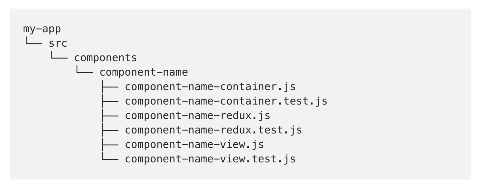

# React Custom Boilerplate

## Build React Project cheatsheet

1. [ Inital Set-up ](#initial-set-up)
2. [ Must-have imports ](#must-have-imports)
3. [ File Structure ](#file-structure)
4. [ Create Component Shortcuts ](#create-component-shortcuts)
5. [ Styling ](#styling)
6. [ Events ](#events)
7. [ Context API ](#context-api)
8. [ Fetch Data ](#fetch-data)
9. [ Toggle True / False in State ](#toggle-true-/-false-in-state)
10. [ Conditional Rendering ](#conditional-rendering)

<a name="initial-set-up"></a>

### **_Inital Set-up_**

- In your terminal, open the directory where you want your new project to exist.
- Use the following command to create (bootstrap) your new project. The `my-app` of the command being the name of your new app.

```
npx create-react-app my-app
```

- Next clean up the following code:

| File      | Code Block                                                    |
| --------- | ------------------------------------------------------------- |
| `App.css` | delete all code                                               |
| `App.js`  | delete everything inside `<div className="App-header"></div>` |

delete the following files and remove any corresponding `import` statements.

| File        | Import Code |
| ----------- | ----------- |
| `logo.svg`  | `App.js`    |
| `index.css` | `index.js`  |

- Remember that auto-save in Visual Code is not ideal for React.

<a name="must-have-imports"></a>

### **_Must-have imports_**

Most web apps wil have more than one page, for that import `react-router-dom` with the following command:

```
npm i react-router-dom
```

Next you will need to import the following into `App.js`:

```jsx
import { BrowserRouter as Router, Route, Switch } from "react-router-dom";
```

However, GitHub pages works only if you use:

```jsx
import { HashRouter as Router, Route, Switch } from "react-router-dom";
```

To use React router, use the `<Router>` component to wrap `<Switch>` and `<Route/>`. This example has a `<LandingPage>` component with the home path (`/`).

```jsx
import React from "react";
import "./App.css";
import { HashRouter as Router, Route, Switch } from "react-router-dom";
import LandingPage from "./components/landing-page/LandingPage";

function App() {
  return (
    <div className="App">
      <Router>
        <Switch>
          <Route path="/" component={LandingPage} />
        </Switch>
      </Router>
    </div>
  );
}

export default App;
```

Material UI is a current UI framework. Install with:

```
npm install @material-ui/core
```

To fetch data, install axios

```
npm i axios
```

<a name="create-component-shortcuts"></a>

### **_Create Component Shortcuts_**

Here are the shortcuts that come with the VS Code ES7 React/Redux/React-Native/JS snippets extension.

- React Class Component is `rcc` (then press tab).
- Stateless Functional Component is `rfc` (then press tab).

<a name="file-structure"></a>

### **_File Structure_**

Inside your `src` folder, create a components folder and group your components by feature or route .

```
common/
  Avatar.js
  Avatar.css
  APIUtils.js
  APIUtils.test.js
feed/
  index.js
  Feed.js
  Feed.css
  FeedStory.js
  FeedStory.test.js
  FeedAPI.js
profile/
  index.js
  Profile.js
  ProfileHeader.js
  ProfileHeader.css
  ProfileAPI.js
```

Here is another example of good file structure:



<a name="styling"></a>

### **_Styling_**

In order to use Sass, you need to install a sass compiler

```
npm install node-sass
```

Inside your common folder, create a `vars.scss` file with variables and import the variables where ever you need.

```scss
$lg: 1200px;
$md: 992px;
$sm: 768px;
$xs: 500px;
$extra-xs: 400px;
```

Design with a mobile first approach using media queries and variables as such:

```scss
@import "../common/vars.scss";

@media screen and (max-width: $xs) {
  #body__typography_h1 {
    font-size: 4rem;
    text-align: center;
    margin-top: 0.35em;
  }
  #body__typography_h2 {
    font-size: 1.75rem;
    text-align: center;
  }
}
```

<a name="events"></a>

### **_Events_**

Events in React are similar to events in Vanilla JavaScript, however they are camelCased:

```jsx
<i onClick={() => console.log("Hello")} />
```

Once your `onClick` is logging to the console, you can create your custom function. You will need to `bind` your custom function (technically it's a method).

```jsx
import React, { Component } from "react";

class Contact extends Component {
  onShowClick() {
    console.log(this.state);
  }

  render() {
    return <i onClick={this.onShowClick.bind(this)} />;
  }
}

export default Contact;
```

<a name="context-api"></a>

### **_Context API_**

If you want to pass state as props to multiple components, you will need a context API.

1. Create a file outside of your components folder and to follow convention, name it `context.js`.
2. `context.js` will use a React core function called `createContext`.

```jsx
import React, { Component } from "react";

const Context = React.createContext();

export class Provider extends Component {}
```

3. Populate the state as needed and export a `Consumer`

```jsx
import React, { Component } from "react";

const Context = React.createContext();

export class Provider extends Component {
  state = {
    contacts: [
      {
        id: 1,
        name: "John Doe",
        email: "jdoe@gmail.com",
        phone: "555-555-5555"
      },
      {
        id: 2,
        name: "Karen Williams",
        email: "karen@gmail.com",
        phone: "222-222-2222"
      },
      {
        id: 3,
        name: "Henry Johnson",
        email: "henry@gmail.com",
        phone: "111-111-1111"
      }
    ]
  };

  render() {
    return (
      <context.Provider value={this.state}>
        {this.props.children}
      </context.Provider>
    );
  }
}

export const Consumer = Context.Consumer;
```

3. After you've exported `Consumer`, you need to go to `App.js`. There will you will need `import { Provider } from './context';`.
4. Wrap everything `<div className="App">` in `<Provider>`.

```jsx
import React, { Component } from "react";
import Contacts from "./components/Contacts";
import Header from "./components/Header";

import { Provider } from "./context";

import "bootstrap/dist/css/bootstrap.min.css";
import "./App.css";

class App extends Component {
  render() {
    return (
      <Provider>
        <div className="App">
          <Header branding="Contact Manager" />
          <div className="container">{<Contacts />}</div>
        </div>
      </Provider>
    );
  }
}

export default App;
```

5. Import `Consumer` in any component that needs to use state defined in the context then wrap where ever you need to access the state as a prop inside `<Consumer>` as seen here:

```jsx
import React, { Component } from "react";
import Contact from "./Contact";
import { Consumer } from "../../context";

class Contacts extends Component {
  render() {
    return (
      <Consumer>
        {value => {
          const { contacts } = value;
          return (
            <React.Fragment>
              <h1 className="display-4 mb2">
                <span className="text-danger">Contact</span> List
              </h1>
              {contacts.map(contact => (
                <Contact key={contact.id} contact={contact} />
              ))}
            </React.Fragment>
          );
        }}
      </Consumer>
    );
  }
}

export default Contacts;
```

Note that value (the first item inside <Consumer>) is getting its value from the value attribute (it looks like an attribute but it's actually a property) that is being set in context.js as seen here:

```jsx
  render() {
    return (
      <context.Provider value={this.state}>
        {this.props.children}
      </context.Provider>
    );
  }
```

For more detailed steps on how to build and use a context API, see https://github.com/lizkovalchuk/Tutorials/blob/master/React-Front-to-Back-Udemy/section-4-state-and-context-API/s4-p4.md.

It covers:

- Reducer Function
- Dispatch
- Payload

<a name="fetch-data"></a>

### **_Fetch Data_**

- If you are using a context API, you will need to `import axios from "axios";` in your `context.js` file.
- `componentDidMount()` is just like `$document.ready()` in jquery. That is a great place to use `axios.get()`.
- It returns a promise, so you can transform that promise to your state.

```jsx
  componentDidMount(){
    axios.get('https://jsonplaceholder.typicode.com/users').then(res => this.setState({contacts: res.data}))
  }
```

<a name="toggle-true-/-false-in-state"></a>

### **_Toggle True / False in State_**

```jsx
import React, { Component } from "react";
import propTypes from "prop-types";

class Contact extends Component {
  state = {
    showContactInfo: true
  };

  onShowClick = e => {
    this.setState({ showContactInfo: !this.state.showContactInfo });
  };

  render() {
    const { name, email, phone } = this.props.contact;
    return (
      <div className="card card-body mb-3">
        <h4>
          {name} <i onClick={this.onShowClick} className="fas fa-sort-down" />
        </h4>
        <ul className="list-group">
          <li className="list-group-item">Email: {email}</li>
          <li className="list-group-item">Phone: {phone}</li>
        </ul>
      </div>
    );
  }
}

Contact.propTypes = {
  contact: propTypes.object.isRequired
};

export default Contact;
```

<a name="conditional-rendering"></a>

### **_Conditional Rendering_**

This code example below checks to see if a variable in state is true, if it is, it renders some code.

```jsx
import React, { Component } from "react";
import propTypes from "prop-types";

class Contact extends Component {
  state = {
    showContactInfo: true
  };

  render() {
    const { name, email, phone } = this.props.contact;
    const { showContactInfo } = this.state;

    return (
      <div className="card card-body mb-3">
        <h4>
          {name}
          <i
            onClick={() =>
              this.setState({ showContactInfo: !this.state.showContactInfo })
            }
            className="fas fa-sort-down"
          />
        </h4>
        {showContactInfo ? (
          <ul className="list-group">
            <li className="list-group-item">Email: {email}</li>
            <li className="list-group-item">Phone: {phone}</li>
          </ul>
        ) : null}
      </div>
    );
  }
}

Contact.propTypes = {
  contact: propTypes.object.isRequired
};

export default Contact;
```
