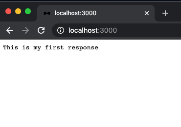

# Angular & NodeJS - The MEAN Stack Guide [2020 Edition]

## Adding NodeJS:  - Section 3

1. [ Intro ](#intro)
2. [ RESTful API ](#restful-api)
3. [ Creating the Server ](#creating-the-server)

<a data="intro"></a>

### **_Intro_**

##### NodeJS

Node is javascript runtime that runs on the server. This means you can execute javascript code with some extra features, that is executed on the server. You can also create the server that listens to requests and sends back responses. Furthermore you can handle your server side logic.

Unlike PHP, which needs a seperate server software like Apache or NGinx, you create the server with NodeJS. 

##### Express

Express is a framework building up on node to create a RESTful API. It is used to make Node development easier. Using Express and NodeJS allows us to create our own server to handle: 
- core business logic
- code that would be too performance intensive to run on the client side
- code that is too security vulnerable to run on the client side


<a data="restful-api"></a>

### **_RESTful API_**

REST stands for:

Representational State Transfer

A RESTful API is a stateless backend. It doesn't care which client connects to it. All it does it expose urls, so called paths, to which you can send requests. For NodeJS and Express, all data is communicated with JSON (not XML or HTML).


<a data="creating-the-server"></a>

### **_Creating the Server_**

1. Create a Javascript file to start building your NodeJS server. Let's name our file `server.js`.
2. Import the `http` package by NodeJS.
    - NodeJS imports by storing the import in a const unlike other js frameworks that import with:

```
import {something} from 'somewhere'
```

3. Instead of `import`, nodeJS uses keyword `require`. (same functionality, different syntax.)

```js
const http = require('http');
```

** The `http` package does not need to be in your `package.json` file because it is a default nodeJS package which is automatically installed when you install NodeJS onto your system. **

4. Use the`http` package has a `create server` method which creates a new server.

```js
http.createServer();
```

5. The `createServer()` method takes a request listener as an argument. The request listener function will execute with every incoming request no matter which path this request targets. The request listener function also takes 2 of it's own arguments, and they are the request and response, which  are targetted as `req` and `res`. Both `req` and `res` are objects that offer data and utility methods that allow us to work with requests and responses.

6. The `res` method has an `end` method which we can pass stuff to. For this example, let's pass a string.

```js
const http = require('http');

http.createServer((req, res) => {
  res.end('This is my first response');
});
```

7. As of step 6, we created the server but it's not active yet. To make the server active, we need to store that server in a new `const` so that we can use the `listen()` method. `listen()` requires a port number as an argument.

```js
const http = require('http');

const server = http.createServer((req, res) => {
  res.end('This is my first response');
});

server.listen(3000);
```

8. However it is also in your interest to set an `||` (an 'or') fir the default port of the hosting provider, and this is indicated with `process.env.PORT` as seen below:

```js
server.listen(process.env.PORT || 3000);
```

** Enviroment variables are dynamically injected variables, they're always accessed on `process.env` which is a NodeJS feature. These injected variables are injected by the runtime. **

9. If you run `node server.js`, the terminal will start an ongoing process which listens for requests.

10. Lastly, go to port `3000` to see your first response:

