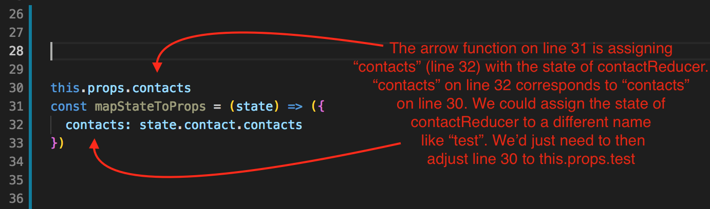
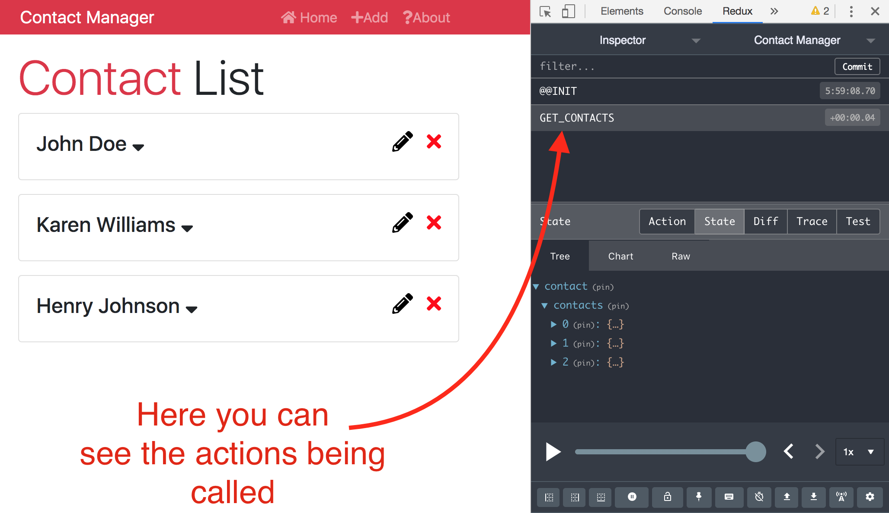

# React Front to Back

## Udemy React Tutorial Notes Section 8: Learning Redux - Part 2

1. [ Actions ](#actions)
2. [ State in Reducer ](#state-in-reducer)
3. [ State from Reducer to Component ](#state-from-reducer-to-component)

<a data="actions"></a>

### **Actions**

In redux, we need to define something action types. In the Context API, actions were defined in a `switch` statement, however in redux, action types are defined as constants in a file. Here's how to define action types:

1. Create an action folder in your source file. Your file structure should look like this now:

```
-src
  -actions
  -components
  -reducers
    -contactReducers.js
    -index.js
```

2. Once you've created an actions folder, create a file inside it called `types.js`.

3. Inside `types.js`, we need to define `const` variables that are equal to the types that we need. In our case, our `const` variables will be set to strings as seen in Figure 1 - actions/types.js

##### Figure 1 - actions/types.js

```jsx
export const GET_CONTACTS = 'GET_CONTACTS';
```

Creating an `actions` folder and `types.js` file gives us a central place for all of our action types. Once an action type has been defined, we're ready to start implementing getting the state from a reducer.

<a data="state-from-reducer"></a>

### **State in Reducer**

At this point in the tutorial, we need to refactor how we are displaying data. Currently, data is getting grabbed from the state in `Contacts.js` as seen below:

#### Contacts.js

```jsx
import React, { Component } from 'react';
import Contact from './Contact';

class Contacts extends Component {
  state = {
    contacts: [
      {
        id: 1,
        name: 'John Doe',
        email: 'john@gmail.com',
        phone: '555-555-5555'
      },
      {
        id: 2,
        name: 'Karen Williams',
        email: 'karen@gmail.com',
        phone: '444-444-4444'
      },
      {
        id: 3,
        name: 'Henry Johnson',
        email: 'henry@gmail.com',
        phone: '333-333-333'
      }
    ]
  };

  render() {
    const { contacts } = this.state;
    return (
      <React.Fragment>
        <h1 className="display-4 mb-2">
          <span className="text-danger">Contact</span> List
        </h1>
        {contacts.map(contact => (
          <Contact key={contact.id} contact={contact} />
        ))}
      </React.Fragment>
    );
  }
}

export default Contacts;
```

The following steps show how we are going to get state from a reducer rather than the state of a component. 

1. Grab the `contact` array from `Contacts.js`'s state and move it to the initial state of your `contactReducer.js` file:


#### contactReducer.js

```jsx

// Before

const initialState = {};

export default function (state = initialState, action) {
  switch (action.type) {
    default:
      return state;
  }
}
```

```jsx

// After:

const initialState = {
    contacts: [
    {
      id: 1,
      name: 'John Doe',
      email: 'john@gmail.com',
      phone: '555-555-5555'
    },
    {
      id: 2,
      name: 'Karen Williams',
      email: 'karen@gmail.com',
      phone: '444-444-4444'
    },
    {
      id: 3,
      name: 'Henry Johnson',
      email: 'henry@gmail.com',
      phone: '333-333-333'
    }
  ]
};

export default function (state = initialState, action) {
  switch (action.type) {
    default:
      return state;
  }
}

```

2. Import the action type `GET_CONTACTS` from `actions/types.js` into `contactReducer.js`. 

3. Once you've imported `GET_CONTACTS`, we can now add it to the `switch` statement in `contactReducer.js`.

```jsx
import { GET_CONTACTS } from '../actions/types'

const initialState = {
    contacts: [
    {
      id: 1,
      name: 'John Doe',
      email: 'john@gmail.com',
      phone: '555-555-5555'
    },
    {
      id: 2,
      name: 'Karen Williams',
      email: 'karen@gmail.com',
      phone: '444-444-4444'
    },
    {
      id: 3,
      name: 'Henry Johnson',
      email: 'henry@gmail.com',
      phone: '333-333-333'
    }
  ]
};

export default function (state = initialState, action) {
  switch (action.type) {
    case GET_CONTACTS: 
      return {
        ...state
      }
    default:
      return state;
  }
}
```

For now, we'll have the case `GET_CONTACT` in our switch statement to simply return the state.

<a data="state-from-reducer-to-component"></a>

### **State from Reducer to Component**

Once we have an action type defined and a case for it in our reducers switch statement, it's time to pass the state from the reducer to the component. In our case, we want to send the state in `contactsReducer.js` to our `Contacts.js` component.

1. In order to get state from a reducer into a component, we need to get something called `connect` from `react-redux`. 
    - Inside `Contacts.js` is where we need state from our `contactsReducer.js`. Therefore, import `connect` from `react-redux` inside `Contacts.js`
    - We'll also need `propTypes` because when we have an action, it's called as a prop. When anything from the redux state is called, it is called into props.
    - In order to use `connect` from `react-redux`, go to the bottom of `Contacts.js` to adjust the export statement.
      - Instead of exporting the component directly (`export default Contacts;`), we'll need to export `connect` and then wrap the component name in parentheses. See Figure 1 - Contacts.js


##### Figure 1 - Contacts.js

```jsx
import React, { Component } from 'react';
import Contact from './Contact';
import { connect } from 'react-redux'
import PropTypes from 'prop-types'

class Contacts extends Component {
  render() {
    const { contacts } = this.state;
    return (
      <React.Fragment>
        <h1 className="display-4 mb-2">
          <span className="text-danger">Contact</span> List
        </h1>
        {contacts.map(contact => (
          <Contact key={contact.id} contact={contact} />
        ))}
      </React.Fragment>
    );
  }
}

export default connect()(Contacts);

```

2. The `connect` method in the export statement in `Contacts.js` is not complete yet though. We need to assign `props` to `Contacts.js` with values from the state in `contactReducer.js` and then pass those `props` to `connect()`.
    - In our `rootReducer` (which is `reducers/index.js`), we defined the data from `contactReducer.js` as `contact` as seen in Figure 2 - reducers/index.js
    - In `Contacts.js`, we need to create an arrow function that will assign the data inside `contact` from our `rootReducer` to a `Contacts.js` property as seen in Figure 3 - Contacts.js. Figure 4 - Contacts.js will show the entire component without red annotations.


##### Figure 2 - reducers/index.js

```jsx
import { combineReducers } from 'redux';
import contactReducer from './contactReducer';

export default combineReducers({
  contact: contactReducer
});
```

##### Figure 3 - Contacts.js



#### Figure 4 - Contacts.js

```jsx
import React, { Component } from 'react';
import Contact from './Contact';
import { connect } from 'react-redux'
import PropTypes from 'prop-types'

class Contacts extends Component {
  render() {
    const { contacts } = this.state;
    return (
      <React.Fragment>
        <h1 className="display-4 mb-2">
          <span className="text-danger">Contact</span> List
        </h1>
        {contacts.map(contact => (
          <Contact key={contact.id} contact={contact} />
        ))}
      </React.Fragment>
    );
  }
}

const mapStateToProps = (state) => ({
  contacts: state.contact.contacts
})

export default connect()(Contacts);
```

3. Similarly to how we assigned the data from our reducers' state to a local property, we need to create a const (or function) that will map dispatch to the component's props as well.
    - Create a `const` called `mapDispatchToProps` and make it an arrow function that takes in `dispatch` as a parameter.
    - The purpose of `mapDispatchToProps` is to define a function which will execute the action defined in `actions/types.js`. In Figure 5 - Contacts.js, we are creating a function called `getContacts` that is calling `dispatch`. We need to pass in an action to `dispatch` which is an object with a type of `GET_CONTACTS` from `actions/types.js`. Do remember that you'll need to import `GET_CONTACTS` from `actions/types.js` as well.

##### Figure 5 - Contacts.js

```jsx
import React, { Component } from 'react';
import Contact from './Contact';
import { connect } from 'react-redux'
import PropTypes from 'prop-types'
import { GET_CONTACTS } from '../../actions/types';

class Contacts extends Component {
  render() {
    const { contacts } = this.state;
    return (
      <React.Fragment>
        <h1 className="display-4 mb-2">
          <span className="text-danger">Contact</span> List
        </h1>
        {contacts.map(contact => (
          <Contact key={contact.id} contact={contact} />
        ))}
      </React.Fragment>
    );
  }
}

const mapStateToProps = (state) => ({
  contacts: state.contact.contacts
})

const mapDispatchToProps = (dispatch) => ({
  getContacts: () => dispatch({type: GET_CONTACTS})
})

export default connect()(Contacts);
```

4. Next, we can supply `connect()` with the values it needs. `connect` needs 2 things:
    - First thing: Anything that we want to map from the redux state to props in the component.
    - Second thing: anything we want to dispatch (actions we want to dispatch for example).
    - Therefore, inside the `connect()` method, pass in both `mapStateToProps` and `mapDispatchToProps`.

```jsx 
export default connect(mapStateToProps, mapDispatchToProps)(Contacts);
```

5. Next, we need to implement `propTypes` as seen in Figure 5 - Contacts.js

##### Figure 5 - Contacts.js

```jsx
Contacts.PropTypes = {
  contacts: PropTypes.array.isRequired,
  getGetContacts: PropTypes.func.isRequired
}
```

6. The last thing we need to do is call `getContacts` which we've defined in `mapDispatchToProps`. 
    - The best place to call it is in `componentDidMount()` as seen in Figure 6 - Contacts.js.
    - Once `getContacts` gets called in `componentDidMount()`, `getContacts` is going to put the contacts into the local props of the component. As a result, we need to destructure from the component's properties, not the state, which results in needed to adjust the destructuring in the `render()` method of `Contacts.js`.

##### Figure 6 - Contacts.js

```jsx
import React, { Component } from 'react';
import Contact from './Contact';
import { connect } from 'react-redux'
import propTypes from 'prop-types'
import { GET_CONTACTS } from '../../actions/types';

class Contacts extends Component {
  componentDidMount() {
    this.props.getContacts;
  }

  render() {
    const { contacts } = this.props;
    return (
      <React.Fragment>
        <h1 className="display-4 mb-2">
          <span className="text-danger">Contact</span> List
        </h1>
        {contacts.map(contact => (
          <Contact key={contact.id} contact={contact} />
        ))}
      </React.Fragment>
    );
  }
}

Contacts.propTypes = {
  contacts: propTypes.array.isRequired,
  getGetContacts: propTypes.func.isRequired
}

const mapStateToProps = (state) => ({
  contacts: state.contact.contacts
})

const mapDispatchToProps = (dispatch) => ({
  getContacts: () => dispatch({type: GET_CONTACTS})
})

export default connect(mapStateToProps, mapDispatchToProps)(Contacts);
```

You can always see the actions being called in the Redux dev tools as seen in Figure 7 - Actions in Redux Dev Tools.

##### Figure 7 - Actions in Redux Dev Tools




